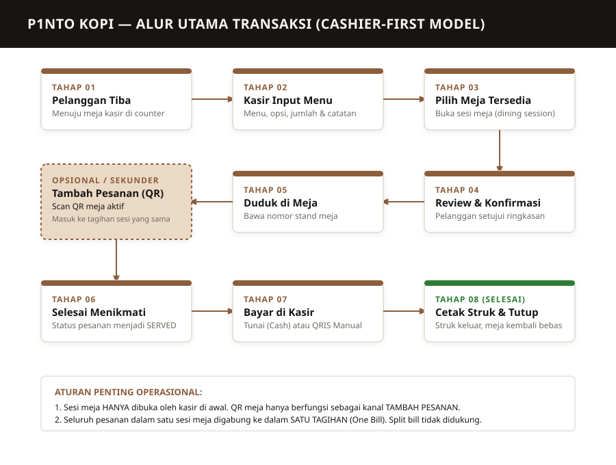
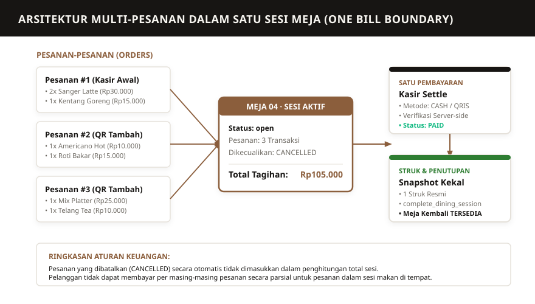
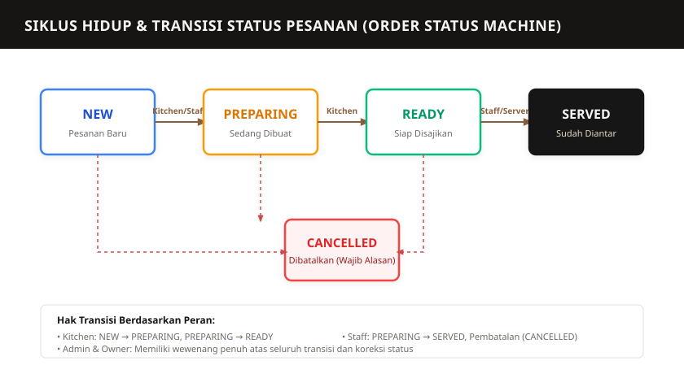
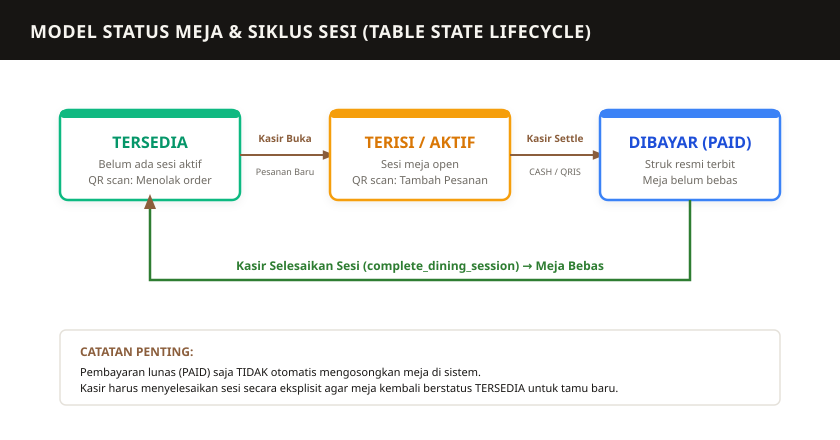

# P1NTO KOPI
## Sistem Operasional & Panduan Penggunaan (Owner & Admin Manual)
### Panduan Resmi Penggunaan Sistem Pemesanan, Meja, Pembayaran, dan Struk
**Situs Web Produksi:** [https://pintokupi.my.id](https://pintokupi.my.id)  
**Versi Manual:** 1.1.0 (Production Release — Compact Receipts & Owner Access Edition)  
**Tanggal Terbit:** 20 September 2026  
**Klasifikasi Dokumen:** Internal Operational Handbook  

---

## 📌 RINGKASAN EKSEKUTIF PEMILIK BISNIS (OWNER'S EXECUTIVE SUMMARY)

Buku panduan ini dirancang agar Anda sebagai **Pemilik Bisnis (*Owner*)** dapat memahami seluruh alur operasional kafe, mengendalikan sistem kasir, memantau omzet, dan menjaga integritas finansial kafe secara mandiri tanpa celah kebocoran kas.

### 🌟 Nilai Strategis Sistem untuk Owner P1NTO Kopi
1. **Pencegahan Kebocoran Kasir (*Anti-Fraud & Cash Control*):**
   - Transaksi tunai wajib menginput nominal uang fisik yang diterima; kembalian dihitung otomatis oleh sistem untuk mencegah selisih uang laci kasir.
   - Pembayaran QRIS diverifikasi langsung oleh kasir dengan memeriksa mutasi riil rekening bank kafe sebelum tombol konfirmasi ditekan.
2. **Satu Meja Satu Tagihan (*One Bill Boundary*):**
   - Setiap meja makan di tempat (*dine-in*) diikat oleh satu **Sesi Meja**.
   - Pelanggan yang menambah pesanan melalui kode QR meja langsung tersambung ke tagihan yang sama. Tidak ada tagihan ganda atau pesanan yang tertinggal saat pembayaran.
3. **Struk Resmi Ringkas & Hemat Kertas Thermal:**
   - Format struk didesain khusus 58 mm yang padat dan elegan.
   - **Pembaruan Terkini:** Header kelompok pesanan (`ORDER Pinto-...`) dihilangkan sehingga seluruh menu langsung tersusun rapi di bawah nomor meja. Ini menghemat minimal 3 baris kertas thermal per pesanan tambahan dan menghemat pengeluaran kertas rol kasir secara signifikan.
4. **Pemisahan Peran yang Ketat (*Separation of Duties*):**
   - Kasir dan Barista hanya memiliki akses operasional harian.
   - Hak melihat omzet/keuntungan, mencatat beban operasional (*expenses*), memproses pengembalian (*refund*), mengelola akun staf, dan menghapus pesanan **terisolasi 100% khusus untuk Owner**.

### 🔑 Kredensial & Akses Cepat Dasbor Owner
* **Portal Login Resmi:** `https://pintokupi.my.id/admin/login` (atau `http://localhost:3000/admin/login`)
* **Akun Utama Owner:** `owner@pinto.kupi` (Kata Sandi awal: `owner123`)
* **Akun Utama Admin:** `admin@pinto.kopi` (Kata Sandi awal: `admin123`)
* **Menu Kunci Owner:**
  - 📊 **Ikhtisar Keuangan:** `/admin/owner/finance` (Omzet, rata-rata transaksi, tren kas vs non-tunai)
  - 📈 **Laporan Laba/Rugi:** `/admin/owner/reports` (Laporan keuangan periodik dan unduh CSV)
  - 💸 **Beban Pengeluaran:** `/admin/owner/expenses` (Catat belanja biji kopi, susu, bahan baku, listrik)
  - 👥 **Kelola Admin & Staf:** `/admin/owner/accounts` (Tambah akun kasir/barista, ubah peran, blokir staf keluar)
  - ⚙️ **Profil Bisnis:** `/admin/settings` (Ubah nama kafe `Pinto Kupi`, WiFi, pesan kaki struk)

---

## DAFTAR ISI

0. [Ringkasan Eksekutif Pemilik Bisnis (Owner's Executive Summary)](#-ringkasan-eksekutif-pemilik-bisnis-owners-executive-summary)
1. [Tentang Sistem & Filosofi Layanan P1NTO Kopi](#1-tentang-sistem--filosofi-layanan-p1nto-kopi)
2. [Struktur Peran Pengguna & Matriks Hak Akses](#2-struktur-peran-pengguna--matriks-hak-akses)
3. [Alur Bisnis Utama: Model Cashier-First](#3-alur-bisnis-utama-model-cashier-first)
4. [Panduan Pelanggan (Customer Journey)](#4-panduan-pelanggan-customer-journey)
5. [SOP Akses Masuk (Login), Kredensial Resmi, & Manajemen Akun](#5-sop-akses-masuk-login-kredensial-resmi--manajemen-akun)
6. [SOP Kasir: Membuat Pesanan Baru Makan di Tempat (Dine-In)](#6-sop-kasir-membuat-pesanan-baru-makan-di-tempat-dine-in)
7. [SOP Kasir: Penanganan Meja Terisi & Fitur "Gabung ke Sesi"](#7-sop-kasir-penanganan-meja-terisi--fitur-gabung-ke-sesi)
8. [SOP Kasir: Tahap Review & Konfirmasi Pesanan](#8-sop-kasir-tahap-review--konfirmasi-pesanan)
9. [SOP Pelanggan & Kasir: Tambah Pesanan Melalui QR Meja](#9-sop-pelanggan--kasir-tambah-pesanan-melalui-qr-meja)
10. [SOP Kitchen & Barista: Antrean KDS & Pembaruan Status Pesanan](#10-sop-kitchen--barista-antrean-kds--pembaruan-status-pesanan)
11. [SOP Kasir: Pembayaran Tagihan — Tunai (Cash)](#11-sop-kasir-pembayaran-tagihan--tunai-cash)
12. [SOP Kasir: Pembayaran Tagihan — QRIS Manual](#12-sop-kasir-pembayaran-tagihan--qris-manual)
13. [SOP Kasir: Penerbitan & Cetak Ulang Struk Pembayaran](#13-sop-kasir-penerbitan--cetak-ulang-struk-pembayaran)
14. [SOP Penggunaan & Konfigurasi Printer Struk (PandaPrinter PRJ-58D)](#14-sop-penggunaan--konfigurasi-printer-struk-pandaprinter-prj-58d)
15. [SOP Kasir: Pesanan Bawa Pulang (Takeaway / Pickup)](#15-sop-kasir-pesanan-bawa-pulang-takeaway--pickup)
16. [SOP Penanganan Pembatalan Pesanan & Menu Habis](#16-sop-penanganan-pembatalan-pesanan--menu-habis)
17. [SOP Kasir: Penyelesaian Sesi Meja (Penutupan Tagihan & Pembebasan Meja)](#17-sop-kasir-penyelesaian-sesi-meja-penutupan-tagihan--pembebasan-meja)
18. [Panduan Khusus Owner: Pemantauan Finansial, Biaya, & Penyesuaian](#18-panduan-khusus-owner-pemantauan-finansial-biaya--penyesuaian)
19. [Panduan Khusus Owner: Manajemen Pengguna & Pengaturan Profil Bisnis](#19-panduan-khusus-owner-manajemen-pengguna--pengaturan-profil-bisnis)
20: [10 Skenario Operasional Nyata Kafe](#20-10-skenario-operasional-nyata-kafe)
21. [Panduan Pemecahan Masalah (Troubleshooting Guide)](#21-panduan-pemecahan-masalah-troubleshooting-guide)
22. [Pertanyaan yang Sering Diajukan (FAQ Operasional)](#22-pertanyaan-yang-sering-diajukan-faq-operasional)
23. [Daftar Periksa Kesiapan Harian (Opening & Closing Checklist)](#23-daftar-periksa-kesiapan-harian-opening--closing-checklist)
24. [Informasi Kontak & Saluran Eskalasi Dukungan](#24-informasi-kontak--saluran-eskalasi-dukungan)
25. [Glosarium Istilah Resmi Sistem](#25-glosarium-istilah-resmi-sistem)

---

## 1. TENTANG SISTEM & FILOSOFI LAYANAN P1NTO KOPI

Sistem Pemesanan dan Kasir (POS) P1NTO Kopi dirancang khusus untuk mengoptimalkan alur operasional kafe dan *roastery* (*Pintö Kupi — Roasted and Eatery*) di Jl. Flamboyan No. 8, Tajur Halang, Bogor.

### 1.1 Filosofi Layanan Kafe: Ramah, Teratur, dan Terkendali
Layanan di P1NTO Kopi mengedepankan interaksi personal yang hangat antara barista/kasir dengan pengunjung pada saat kedatangan. Oleh karena itu, sistem mengadopsi model **Cashier-First**:
1. **Penyambutan Hangat di Kasir:** Pelanggan yang baru tiba langsung disambut di meja kasir untuk memilih minuman signature (seperti *Sanger Latte* khas Aceh, *Aren Latte*, *V-60*, atau makanan ringan).
2. **Penetapan Meja Terstruktur:** Kasir menetapkan nomor meja yang masih kosong (`Tersedia`), sehingga menghindari perebutan meja atau pelanggan duduk di meja yang belum dibersihkan.
3. **Konfirmasi Sebelum Duduk:** Kasir dan pelanggan memeriksa pesanan bersama di layar kasir guna memastikan pesanan, opsi suhu (Panas/Dingin), dan catatan khusus telah sesuai sebelum dibuat oleh barista.
4. **Kenyamanan Tambah Pesanan Mandiri:** Setelah duduk, pelanggan tidak perlu bolak-balik ke kasir untuk menambah minuman atau camilan. Cukup memindai kode QR pada nomor stand meja mereka untuk memesan menu tambahan.
5. **Satu Meja Satu Tagihan:** Seluruh pesanan tambahan disatukan ke tagihan meja yang sama, dibayar sekaligus di kasir saat pelanggan selesai berkunjung.

---

## 2. STRUKTUR PERAN PENGGUNA & MATRIKS HAK AKSES

Sistem menerapkan model hak akses berbasis peran (*Role-Based Access Control* / RBAC) yang ketat, dikontrol secara berlapis pada tingkat antarmuka aplikasi Next.js dan tingkat basis data (PostgreSQL Row-Level Security & Security Definer RPCs).

```
                 ┌────────────────────────────────┐
                 │             OWNER              │
                 │  (Akses Mutlak: Finansial +    │
                 │   Akun Staf + Hapus Pesanan)   │
                 └───────────────┬────────────────┘
                                 │
                 ┌───────────────▼────────────────┐
                 │             ADMIN              │
                 │  (Operasional Penuh: Kasir +   │
                 │   Katalog Menu + Meja + Struk) │
                 └───────────────┬────────────────┘
                                 │
        ┌────────────────────────┴────────────────────────┐
        │                                                 │
┌───────▼───────────────┐                       ┌─────────▼─────────────┐
│        STAFF          │                       │        KITCHEN        │
│ (Kasir & Pramusaji:   │                       │ (Barista & Dapur:     │
│  POS, Bayar, Struk)   │                       │  Antrean KDS Khusus)  │
└───────────────────────┘                       └───────────────────────┘
```

### 2.1 Rincian 4 Peran Resmi Sistem

#### 👑 1. Owner (Pemilik Bisnis)
Peran tertinggi dengan otoritas mutlak dalam ekosistem P1NTO Kopi:
* **Pengawasan Finansial Eksklusif:** Mengakses modul pendapatan, grafik tren penjualan harian/bulanan, rincian omzet kas vs QRIS, dan mengunduh laporan keuangan berformat CSV (`/admin/owner/reports`).
* **Pencatatan Biaya & Beban (*Expenses*):** Mencatat pengeluaran operasional (seperti belanja biji kopi sangrai, susu segar, cup, listrik, internet) di `/admin/owner/expenses` agar laba bersih kafe terhitung akurat.
* **Koreksi & Refund Finansial:** Memproses penyesuaian dana (*adjustments*) jika terjadi pengembalian dana resmi ke pelanggan tanpa merusak integritas snapshot struk historis.
* **Manajemen Akun Staf:** Menambah akun kasir/barista baru, menaikkan/menurunkan peran, serta menonaktifkan akun staf yang berhenti di `/admin/owner/accounts`.
* **Aksi Destruktif Terkendali:** Satu-satunya peran yang memiliki izin menghapus atau mengarsipkan rekaman pesanan yang salah dibuat (`admin_delete_order`).
* **Profil Bisnis:** Mengubah nama bisnis kafe (`Pinto Kupi`), nomor WhatsApp, alamat, informasi WiFi, dan pesan kaki struk di menu Pengaturan.

#### 🛡️ 2. Admin (Supervisor / Manajer Kafe)
Mengelola kelancaran operasional kafe setiap hari tanpa hak mengakses data rahasia laba/rugi:
* Mengoperasikan antarmuka kasir (*Pesanan Baru*, penanganan meja terisi, konfirmasi pembayaran, dan cetak struk).
* Mengelola status ketersediaan meja fisik kafe (`/admin/tables`).
* Menambah, mengedit, atau menonaktifkan menu produk, varian rasa, harga satuan, dan kategori produk (`/admin/menu/*`).
* Menghubungkan dan menguji koneksi printer thermal kasir (`/admin/settings`).
* **Batasan Admin:** Admin **TIDAK BISA** melihat laporan keuangan/omzet Owner, tidak bisa mencatat pengeluaran, tidak bisa menghapus pesanan, dan tidak bisa mengubah akun staf lain.

#### ☕ 3. Staff (Kasir & Pramusaji Lantai)
Fokus murni pada pelayanan tamu dan kecepatan transaksi di meja kasir:
* Membuka pesanan baru makan di tempat (*Dine-In*) dan memilih meja kosong.
* Membuka pesanan bawa pulang (*Takeaway / Pickup*) tanpa mengikat meja fisik.
* Mengonfirmasi pembayaran tunai (CASH) dengan kalkulator kembalian otomatis.
* Mengonfirmasi pembayaran non-tunai (QRIS) setelah memeriksa mutasi rekening kasir.
* Menerbitkan dan mencetak ulang (*reprint*) struk pembayaran resmi thermal 58 mm.
* Menyelesaikan sesi meja (*Tutup Sesi*) setelah tamu beranjak dari meja.
* Mengubah status pesanan menjadi `SERVED` saat mengantarkan pesanan ke meja.
* **Batasan Staff:** Kasir **TIDAK BISA** mengubah harga produk di menu, tidak bisa mengakses data finansial kafe, dan tidak bisa menghapus rekaman pesanan di database.

#### 🍳 4. Kitchen (Barista & Tim Dapur)
Akses khusus layar antrean pesanan dapur (*Kitchen Display System* / KDS) di `/admin/kitchen`:
* Memantau daftar pesanan baru yang masuk secara langsung (*realtime polling*).
* Mengubah status pesanan: dari `NEW` menjadi `PREPARING` (sedang diracik/dimasak), lalu menjadi `READY` (siap saji).
* Memeriksa catatan khusus pelanggan (seperti *"Dingin / Ice"*, *"Less sugar"*, *"Espresso dipisah"*, *"Tanpa cabai"*).
* **Batasan Kitchen:** Tim dapur **TERISOLASI TOTAL** dari fungsi kasir, tidak dapat menerima uang, tidak dapat membuka tagihan, dan tidak dapat mengubah katalog menu.

### 2.2 Prinsip Pemisahan Tugas (*Separation of Duties*)
P1NTO Kopi menerapkan prinsip keamanan perbankan:
1. **Kasir Tidak Mengubah Harga:** Kasir hanya bertugas melayani dan memungut uang sesuai harga resmi sistem. Kenaikan harga atau diskon dikontrol oleh Admin/Owner.
2. **Kasir Tidak Menghapus Transaksi:** Kasir tidak dapat menghapus pesanan yang sudah dibuat untuk menyembunyikan uang tunai. Jika pesanan batal, statusnya diubah menjadi `CANCELLED` dengan alasan wajib, dan hak hapus permanen hanya ada di tangan Owner.
3. **Dapur Terpisah dari Uang:** Barista murni fokus meracik kopi dengan konsisten tanpa dibebani transaksi kasir.

### 2.3 Matriks Hak Akses Terverifikasi

| Fitur & Wewenang Sistem | Owner (Pemilik) | Admin (Manajer) | Staff (Kasir) | Kitchen (Dapur) |
|---|:---:|:---:|:---:|:---:|
| **Masuk Sistem (Login Portal)** | ✅ YA | ✅ YA | ✅ YA | ✅ YA |
| **Buka Pesanan Kasir (Pesanan Baru)** | ✅ YA | ✅ YA | ✅ YA | ❌ DILARANG |
| **Buka Sesi Meja Makan di Tempat** | ✅ YA | ✅ YA | ✅ YA | ❌ DILARANG |
| **Gabung Pesanan ke Meja Terisi** | ✅ YA | ✅ YA | ✅ YA | ❌ DILARANG |
| **Buat Pesanan Bawa Pulang (Takeaway)** | ✅ YA | ✅ YA | ✅ YA | ❌ DILARANG |
| **Ubah Status Pesanan: `PREPARING`** | ✅ YA | ✅ YA | ✅ YA | ✅ YA |
| **Ubah Status Pesanan: `READY`** | ✅ YA | ✅ YA | ❌ DILARANG | ✅ YA |
| **Ubah Status Pesanan: `SERVED`** | ✅ YA | ✅ YA | ✅ YA | ❌ DILARANG |
| **Batalkan Pesanan (`CANCELLED`)** | ✅ YA | ✅ YA | ✅ YA | ❌ DILARANG |
| **Konfirmasi Pembayaran CASH** | ✅ YA | ✅ YA | ✅ YA | ❌ DILARANG |
| **Konfirmasi Pembayaran QRIS Manual** | ✅ YA | ✅ YA | ✅ YA | ❌ DILARANG |
| **Cetak & Cetak Ulang Struk Thermal** | ✅ YA | ✅ YA | ✅ YA | ❌ DILARANG |
| **Selesaikan Sesi Meja (Kosongkan Meja)** | ✅ YA | ✅ YA | ✅ YA | ❌ DILARANG |
| **Kelola Produk, Varian, & Harga Menu** | ✅ YA | ✅ YA | ❌ DILARANG | ❌ DILARANG |
| **Konfigurasi Perangkat Printer Struk** | ✅ YA | ✅ YA | ✅ YA | ❌ DILARANG |
| **Arsip / Hapus Pesanan Permanen** | ✅ YA | ❌ DILARANG | ❌ DILARANG | ❌ DILARANG |
| **Kelola Akun Staf (Tambah/Ubah/Blokir)** | ✅ YA | ❌ DILARANG | ❌ DILARANG | ❌ DILARANG |
| **Ubah Profil Bisnis (Nama Kafe, WiFi)** | ✅ YA | ❌ DILARANG | ❌ DILARANG | ❌ DILARANG |
| **Input Beban Pengeluaran (Expenses)** | ✅ YA | ❌ DILARANG | ❌ DILARANG | ❌ DILARANG |
| **Catat Refund & Koreksi Finansial** | ✅ YA | ❌ DILARANG | ❌ DILARANG | ❌ DILARANG |
| **Lihat Laporan Omzet, Laba/Rugi, & CSV** | ✅ YA | ❌ DILARANG | ❌ DILARANG | ❌ DILARANG |
| **Pantau Jejak Audit Log Seluruh Sistem** | ✅ YA | ❌ DILARANG | ❌ DILARANG | ❌ DILARANG |

---

## 3. ALUR BISNIS UTAMA: MODEL CASHIER-FIRST

Diagram alur berikut menunjukkan perjalanan transaksi lengkap di P1NTO Kopi dari awal kedatangan hingga meja kembali bersih dan tersedia.



### Tahapan Transaksi Utama:
1. **Pelanggan Datang:** Pelanggan mendatangi meja kasir di area pemesanan.
2. **Kasir Memasukkan Pesanan:** Kasir memilih menu pesanan pada sistem POS kasir (`/admin/orders/new`).
3. **Pemilihan Meja:** Kasir memilih meja yang berstatus `Tersedia` (misalnya Meja 04). Sistem secara otomatis membuka baris sesi meja (`dining_sessions`) dengan status `open`.
4. **Review & Konfirmasi:** Pelanggan memeriksa rincian pesanan dan total harga pada layar kasir. Setelah disetujui, kasir menekan tombol konfirmasi.
5. **Pelanggan Menuju Meja:** Pelanggan menerima nomor stand meja dan duduk di meja yang telah ditetapkan. Pesanan diteruskan ke barista/kitchen.
6. **Tambah Pesanan via QR (Opsional):** Jika ingin menambah pesanan, pelanggan memindai QR code pada stand meja untuk mengakses menu dan mengirim pesanan tambahan ke sesi meja yang sama.
7. **Penyajian Menu:** Barista/dapur memproses pesanan hingga status `READY`, lalu pelayan mengantarkan ke meja (`SERVED`).
8. **Pembayaran di Kasir:** Setelah selesai makan/minum, pelanggan kembali ke kasir untuk membayar seluruh tagihan meja (Cash atau QRIS).
9. **Struk Diterbitkan & Sesi Selesai:** Kasir mencetak struk resmi, menutup sesi meja, dan meja otomatis berstatus `Tersedia` kembali.

---

## 4. PANDUAN PELANGGAN (CUSTOMER JOURNEY)

Bagian ini dirancang agar dapat dijelaskan oleh staf kepada pelanggan atau dipasang sebagai panduan ringkas di meja kafe.

### Cara Menikmati Waktu Santai di P1NTO Kopi

1. **Pesan di Meja Kasir**  
   Saat pertama kali tiba, silakan langsung menuju meja kasir. Sampaikan pilihan kopi, minuman non-kopi, atau camilan yang ingin Anda nikmati kepada staf kami.
2. **Pilih Tempat Duduk**  
   Kasir kami akan membantu mencocokkan meja yang nyaman dan masih tersedia. Anda akan diberikan nomor stand meja untuk dibawa ke meja Anda.
3. **Periksa Pesanan Anda**  
   Sebelum pesanan diproses, kasir akan memperlihatkan ringkasan menu yang Anda pesan pada layar. Pastikan pilihan suhu minuman (Dingin/Panas) dan catatan khusus Anda sudah sesuai.
4. **Duduk Nyaman di Meja**  
   Silakan menuju meja Anda, letakkan nomor stand di atas meja, dan nikmati suasana santai P1NTO Kopi sementara barista kami meracik pesanan Anda.
5. **Ingin Tambah Pesanan? Scan QR di Meja**  
   Tidak perlu beranjak dari tempat duduk jika Anda ingin menambah kopi atau camilan. Pindai (scan) kode QR pada nomor meja Anda menggunakan kamera ponsel. Pilih menu yang diinginkan, dan pesanan tambahan akan otomatis tergabung ke tagihan meja Anda!
6. **Selesaikan Pembayaran Sebelum Pulang**  
   Ketika Anda telah selesai menikmati waktu di P1NTO Kopi, silakan kembali ke kasir dan sebutkan nomor meja Anda. Seluruh pesanan Anda dirangkum dalam satu tagihan. Pembayaran dapat dilakukan dengan **Uang Tunai (Cash)** atau **QRIS**.
7. **Terima Struk Resmi Pembayaran**  
   Kasir akan menyerahkan struk resmi pembayaran Anda. Terima kasih telah berkunjung ke P1NTO Kopi!

## 5. SOP AKSES MASUK (LOGIN), KREDENSIAL RESMI, & MANAJEMEN PENGGUNA

Setiap kasir, barista, admin, dan pemilik bisnis wajib masuk ke sistem menggunakan akun pribadi masing-masing guna menjamin pertanggungjawaban transaksi (*audit trail*) dan kepatuhan finansial.

### 5.1 Portal Akses Resmi
```text
URL Portal Login : https://pintokupi.my.id/admin/login
URL Pengujian    : http://localhost:3000/admin/login
```

### 5.2 Akun Kredensial Resmi Sistem

> [!IMPORTANT]
> **Kredensial Login Bawaan untuk Masuk ke Sistem (`/admin/login`):**
> * **👑 AKUN OWNER (Pemilik Kafe):**
>   - **Email:** `owner@pinto.kupi`
>   - **Password:** `owner123`
>   - **Wewenang:** Akses tak terbatas (Laporan Laba/Rugi, Penjualan, Pengeluaran, Manajemen Akun Staf, Hapus Transaksi, dan Profil Bisnis/Struk).
> * **🛡️ AKUN ADMIN (Supervisor / Manajer):**
>   - **Email:** `admin@pinto.kopi`
>   - **Password:** `admin123`
>   - **Wewenang:** Operasional harian (POS Kasir, Katalog Menu & Harga, Tata Letak Meja, dan Pengaturan Printer).

Sistem dilengkapi dengan rincian peran bawaan (*pre-configured accounts*) sebagai berikut:

| Peran | Alamat Email | Kata Sandi Bawaan | Tujuan & Wilayah Kerja |
|---|---|---|---|
| **👑 OWNER** | `owner@pinto.kupi` | `owner123` | Pemilik Kafe: Akses Penuh ke Laporan Laba/Rugi, Finansial, Beban Pengeluaran, Manajemen Akun Staf, Hapus Pesanan, & Profil Bisnis. |
| **🛡️ ADMIN** | `admin@pinto.kopi` | `admin123` | Supervisor/Manajer: Operasional Meja Kasir, Katalog Menu & Harga, Manajemen Meja, Pratinjau Struk, & Printer POS. |
| **☕ STAFF** | Dibuat oleh Owner | Dibuat oleh Owner | Kasir & Pelayan: Buka Pesanan Baru, Konfirmasi Bayar Tunai & QRIS, Cetak Struk Thermal, & Selesaikan Meja. |
| **🍳 KITCHEN** | Dibuat oleh Owner | Dibuat oleh Owner | Barista & Dapur: Layar Display Dapur KDS (`/admin/kitchen`), Update Pesanan (`PREPARING` → `READY`). |

> [!WARNING]
> **Rekomendasi Keamanan Owner:**
> Segera perbarui kata sandi bawaan `owner123` dan `admin123` pada penggunaan produksi nyata guna mencegah akses tidak berwenang dari perangkat yang tidak diawasi.

### 5.3 Prosedur Masuk (Login) ke Sistem:
1. Nyalakan perangkat kasir (laptop / tablet / POS Box / PC) dan buka peramban Google Chrome.
2. Buka alamat `https://pintokupi.my.id/admin/login`.
3. Masukkan **Email** dan **Kata Sandi** terdaftar.
4. Klik tombol **Masuk**.
5. Sistem memverifikasi kredensial secara aman di Supabase Auth:
   - **Berhasil:** Pengguna diarahkan ke dasbor utama `/admin` (atau langsung ke `/admin/kitchen` jika akun memiliki peran khusus dapur).
   - **Gagal (Kata Sandi Salah):** Muncul pesan galat merah: *"Email atau kata sandi yang Anda masukkan salah."*
   - **Gagal (Akun Dinonaktifkan):** Jika akun staf telah dinonaktifkan oleh Owner, sistem memblokir akses dan menampilkan pesan:  
     > *"Akun Dinonaktifkan: Akun Anda telah dinonaktifkan oleh owner. Hubungi owner untuk mengaktifkan kembali."*

### 5.4 Panduan Lengkap Owner: Mengelola Akun Staf (`/admin/owner/accounts`)

Owner memiliki kendali mutlak atas seluruh akun yang memiliki akses ke sistem kafe. Seluruh pengelolaan dilakukan melalui menu **Kelola Admin & Staf** (`/admin/owner/accounts`):

#### 1. Menambah Akun Staf Baru:
1. Masuk sebagai **Owner** (`owner@pinto.kupi`).
2. Buka menu **Kelola Admin** pada bilah navigasi kiri (`/admin/owner/accounts`).
3. Klik tombol **+ Tambah Akun** di sudut kanan atas.
4. Isi formulir pop-up dialog:
   - **Nama Lengkap:** Nama kasir atau barista (misal: "Ahmad Kasir Pagi").
   - **Email:** Alamat email unik (misal: `ahmad@pinto.kupi`).
   - **Kata Sandi:** Minimal 6 karakter.
   - **Peran (*Role*):** Pilih antara `Staff` (Kasir), `Kitchen` (Dapur), atau `Admin` (Supervisor).
5. Klik **Simpan Akun**. Akun langsung aktif dan staf dapat langsung login di perangkat kasir/dapur.

#### 2. Mengubah Peran Staf (*Role Escalation / Demotion*):
Jika staf dipromosikan atau dipindahtugaskan dari dapur ke kasir:
1. Pada tabel akun, klik tombol menu aksi (tiga titik `···`) di baris nama staf.
2. Pilih **Ubah Peran**.
3. Pilih peran baru, lalu klik **Simpan Perubahan**. Perubahan peran berlaku seketika pada sesi berikutnya.

#### 3. Menonaktifkan Staf Keluar / Cuti (PENTING):
Jika seorang karyawan kasir/barista mengundurkan diri atau diberhentikan:
1. Temukan akun karyawan tersebut di tabel daftar staf.
2. Klik tombol saklar / toggle status pada kolom **Status** dari **Aktif (Hijau)** menjadi **Nonaktif (Abu-abu)**.
3. **Hasil Seketika:** Karyawan tersebut seketika **tidak akan bisa login lagi** ke sistem kasir.
4. **Keamanan Data Transaksi:** Menolak akses dengan cara menonaktifkan akun adalah praktik terbaik karena **tidak menghapus riwayat transaksi masa lalu** yang pernah dicatat oleh kasir tersebut (jejak audit kasir pada struk dan laporan harian tetap utuh).

#### 4. Proteksi Anti-Lockout Basis Data (*Database Safeguard*):
Sistem P1NTO Kopi dipersenjatai pemicu basis data otomatis (`profiles_prevent_last_owner_removal`). Sistem **secara mutlak menolak** penghapusan atau penonaktifan akun Owner jika hanya tersisa satu akun Owner aktif di kafe. Pemilik kafe tidak akan pernah terkunci (*locked out*) dari sistemnya sendiri.

### 5.5 Prosedur Serah Terima Shift (*Shift Handover*) & Keamanan Akun
1. **Dilarang Berbagi Akun Kasir:** Setiap staf kasir wajib menggunakan akun email masing-masing saat bertugas di mesin kasir agar transaksi yang tercatat di laporan kasir dapat dipertanggungjawabkan per individu.
2. **Wajib Keluar Saat Ganti Shift:** Saat pergantian giliran kerja (*shift change*), kasir lama wajib menekan tombol **Keluar (Sign Out)** di pojok navigasi sebelum kasir shift berikutnya masuk (*login*) dengan akun pribadinya.

---

## 6. SOP KASIR: MEMBUAT PESANAN BARU MAKAN DI TEMPAT (DINE-IN)

Halaman utama pembukaan pesanan berada pada menu **Pesanan Baru** (`/admin/orders/new`).

### Langkah Demi Langkah:

#### Langkah 1: Buka Antarmuka POS
Pilih menu **Pesanan Baru** pada bilah navigasi sebelah kiri. Pastikan tab **Makan di tempat** aktif.

#### Langkah 2: Pilih Kategori dan Produk
* Pilih kategori menu yang diinginkan (*White Coffee*, *Black Coffee*, *Non-Coffee*, *Makanan & Camilan*, dll.) atau gunakan kolom pencarian di bagian atas.
* Klik produk yang dipesan pelanggan.

#### Langkah 3: Pilih Varian dan Opsi Produk
* Jika produk memiliki varian (misal berat biji kopi atau ukuran), pilih varian yang sesuai.
* Jika produk memiliki pilihan grup opsi wajib (*Required Options*, misalnya **Suhu Penyajian**):
  - Pilih **Dingin / Ice** atau **Panas / Hot**.
  - Produk tidak dapat dimasukkan ke keranjang sebelum opsi wajib dipilih.
* Klik tombol **Tambah ke Keranjang**.

#### Langkah 4: Sesuaikan Kuantitas & Catatan Khusus
* Pada panel keranjang di sisi kanan, sesuaikan kuantitas menggunakan tombol **+** atau **-**.
* Jika pelanggan memiliki permintaan khusus (misalnya *"gula sedikit / less sugar"*, *"tidak pedas"*, atau *"es dipisah"*), klik kolom catatan item dan ketik permintaan tersebut.

#### Langkah 5: Pilih Meja yang Tersedia
* Pada bagian **Pilih Meja**, perhatikan status meja:
  - Kotak Meja Berwarna Hijau / Abu-abu berlabel **Tersedia**: Meja kosong dan siap dipilih. Klik meja tersebut (misal **Meja 04**).
  - Kotak Meja Berlabel **Terisi**: Meja sedang digunakan oleh pelanggan lain.

#### Langkah 6: Masukkan Nama Pelanggan (Opsional)
Ketik nama pelanggan pada kolom *Nama Pelanggan* jika diperlukan (misal: "Bpk. Rian"). Jika dikosongkan, sistem otomatis memberi nama *"Meja [Nomor]"*.

#### Langkah 7: Lanjut ke Tahap Konfirmasi
Klik tombol **Lanjut ke Konfirmasi** di bagian bawah keranjang.

---

## 7. SOP KASIR: PENANGANAN MEJA TERISI & FITUR "GABUNG KE SESI"

Sistem P1NTO Kopi melindungi integritas tagihan dengan melarang penggabungan meja secara otomatis atau diam-diam (*no silent merge*).

```
                      Kasir Memilih Meja
                             │
            ┌────────────────┴────────────────┐
            ▼                                 ▼
     Status: TERSEDIA                  Status: TERISI
            │                                 │
     Langsung Terpilih                Muncul Pop-up Dialog:
            │                        "Meja sedang memiliki
     Lanjut ke Review                      sesi aktif"
                                              │
                              ┌───────────────┴───────────────┐
                              ▼                               ▼
                         Klik "BATAL"              Klik "GABUNG KE SESI"
                              │                               │
                       Pilih Meja Lain              Pesanan Baru Bergabung
                     (Meja Tetap Terpisah)          ke Tagihan Sesi Meja
```

### Prosedur Penanganan:

1. **Jika Meja Dipilih Berstatus "Terisi":**
   Sistem akan memblokir pemilihan langsung dan memunculkan dialog pop-up konfirmasi:
   > *"Meja [Nomor] sedang memiliki sesi aktif. Total sesi saat ini: RpXX.XXX. Pilih meja lain, atau gabung ke sesi secara eksplisit."*

2. **Kapan Memilih "Batal"?**
   Jika pelanggan yang datang adalah **rombongan tamu baru yang berbeda**, klik **Batal**. Kasir wajib mencarikan meja lain yang masih berstatus `Tersedia`. Jangan pernah menggabungkan tamu yang berbeda ke meja yang sama!

3. **Kapan Memilih "Gabung ke Sesi"?**
   Gunakan tombol ini HANYA jika:
   - Pelanggan adalah teman/anggota keluarga dari tamu yang **sudah duduk** di meja tersebut dan ingin memesan menu tambahan dari kasir.
   - Pelanggan secara sadar menyetujui bahwa pesanan mereka akan disatukan ke tagihan meja yang sedang berjalan.
4. Setelah kasir mengklik **Gabung ke Sesi**, label pada antarmuka kasir akan berubah menjadi `Bergabung · Meja [Nomor]`.

---

## 8. SOP KASIR: TAHAP REVIEW & KONFIRMASI PESANAN

Tahap Review (*Review Step*) adalah titik kendali mutu penting sebelum data pesanan dikirim ke basis data.

### Yang Harus Diperiksa Bersama Pelanggan:
1. **Daftar Menu & Kuantitas:** Bacakan kembali item yang dipesan (contoh: *"2 Sanger Latte Dingin dan 1 Kentang Goreng"*).
2. **Catatan Khusus:** Konfirmasikan catatan (contoh: *"Dengan catatan gula aren sedikit ya Kak"*).
3. **Nomor Meja:** Pastikan nomor meja sudah tepat.
4. **Total Harga:** Tunjukkan total nominal pesanan di layar kasir.

### Tindakan:
* **Jika Ada Perubahan:** Klik tombol **Kembali & Ubah**. Kasir dapat menambah/mengurangi menu atau mengubah meja.
* **Jika Pesanan Sudah Sesuai:** Klik tombol **Konfirmasi Pesanan**.

### Hasil Sistem (*State Transition*):
* Sistem mencatat pesanan baru dengan status awal `NEW`.
* Sesi meja (`dining_sessions`) berstatus `open` aktif.
* Layar menampilkan konfirmasi sukses:
  > **"Pesanan diterima. Meja [Nomor]"**  
  > *"Silakan membawa stand meja [Nomor]. Tempat duduk bebas. Untuk menambah pesanan, scan QR pada stand meja."*
* Kasir menyerahkan nomor stand meja fisik kepada pelanggan.

---

## 9. SOP PELANGGAN & KASIR: TAMBAH PESANAN MELALUI QR MEJA

QR Code yang terpasang pada stand meja fisik dirancang secara eksklusif sebagai kanal **Tambah Pesanan** bagi pelanggan yang telah duduk.



### 9.1 Mekanisme Proteksi QR Meja:
* **Jika Meja Belum Memiliki Sesi Aktif:**  
  Ketika pelanggan memindai QR meja kosong (tanpa sesi kasir), sistem menampilkan:
  > **"Meja [Nomor]"**  
  > **"Belum ada sesi aktif. Silakan melakukan pemesanan di kasir terlebih dahulu."**  
  *Sistem tidak menampilkan tombol menu, tidak menampilkan keranjang, dan tidak membuat baris sesi palsu di database.*
* **Jika Meja Memiliki Sesi Aktif:**  
  Sistem mendeteksi sesi `open` dan menampilkan:
  > **"Meja [Nomor]"**  
  > **"Selamat menikmati. Tambah pesanan kapan saja."**  
  > Tombol: **[Tambah Pesanan]**

### 9.2 Alur Tambah Pesanan Mandiri oleh Pelanggan:
1. Pelanggan memindai QR code meja menggunakan kamera smartphone.
2. Klik tombol **Tambah Pesanan**.
3. Sistem menetapkan cookie sesi aman (*session token*) dan mengarahkan ke katalog menu meja (`/t/[slug]/menu`).
4. Pelanggan memilih menu tambahan, memilih varian/suhu, dan memasukkan ke keranjang.
5. Pada halaman keranjang, sistem menampilkan pengingat:
   > *"Pesanan langsung diteruskan ke kasir. Pembayaran seluruh tagihan meja dilakukan setelah selesai melalui kasir dengan tunai atau QRIS."*
6. Pelanggan menekan tombol **Kirim Pesanan**.
7. Pesanan tambahan tercatat di sistem dengan nomor pesanan baru, otomatis bergabung ke sesi meja aktif yang sama, dan langsung muncul pada antrean kasir serta Kitchen KDS.

---

## 10. SOP KITCHEN & BARISTA: ANTREAN KDS & PEMBARUAN STATUS PESANAN

Dapur dan barista mengoperasikan layar **Kitchen Display System (KDS)** pada alamat:
`https://pintokupi.my.id/admin/kitchen`



### Siklus Status Pesanan:

| Status | Makna Operasional | Aktor Pengubah | Tindakan Selanjutnya |
|---|---|:---:|---|
| **`NEW`** | Pesanan baru saja masuk dari kasir atau QR meja. | Sistem (Otomatis) | Tim dapur/barista melihat antrean dan mulai meracik bahan. |
| **`PREPARING`** | Minuman/makanan sedang dalam proses peracikan atau pemasakan. | Kitchen / Barista / Staff | Tim dapur fokus menyelesaikan pembuatan menu. |
| **`READY`** | Seluruh item pesanan telah selesai diracik, ditata di nampan saji, dan siap diantar. | Kitchen / Barista | Pramusaji/staf lantai mengambil pesanan untuk diantar ke meja. |
| **`SERVED`** | Menu telah diterima oleh pelanggan di meja mereka. | Pramusaji / Staff Lantai | Pelanggan menikmati pesanan. Status pesanan selesai secara fisik. |
| **`CANCELLED`** | Pesanan dibatalkan karena alasan tertentu (wajib mencantumkan alasan). | Kasir / Admin / Owner | Pesanan tidak disajikan dan otomatis dikeluarkan dari tagihan. |

> [!CAUTION]
> **Aturan Penting Status:**
> Memperbarui status pesanan menjadi `READY` atau `SERVED` **TIDAK** mengubah status pembayaran dan **TIDAK** menutup sesi meja. Pembayaran dan penutupan meja adalah wewenang kasir di kasir utama.

---

## 11. SOP KASIR: PEMBAYARAN TAGIHAN — TUNAI (CASH)

Pembayaran dilakukan di akhir kunjungan pelanggan di meja kasir.

### Langkah Demi Langkah Pembayaran Tunai:

1. Pelanggan mendatangi kasir dan menyebutkan nomor meja (misal: "Meja 04").
2. Kasir membuka detail sesi meja melalui menu **Sesi Meja** (`/admin/sessions/[id]`) atau mencari pesanan di daftar pesanan.
3. Kasir memastikan seluruh pesanan pada sesi tersebut telah disajikan (`SERVED`).
4. Sistem menampilkan total tagihan gabungan meja.
   *Contoh Riil:*
   - 2× Sanger Latte @ Rp15.000 = Rp30.000
   - 1× Kentang Goreng = Rp15.000
   - 1× Mix Platter = Rp25.000  
   **Total Tagihan: Rp70.000**
5. Kasir memilih tab metode pembayaran: **CASH (Tunai)**.
6. Kasir menanyakan dan menerima uang tunai dari pelanggan.
7. Masukkan nominal uang yang diterima pada kolom **Uang Diterima** (misal: `100000`).
8. Sistem secara otomatis menghitung dan menampilkan nominal kembalian di layar:
   > **Kembalian: Rp30.000**
9. Kasir menghitung uang kembalian fisik sebesar Rp30.000 dan meletakkannya di counter.
10. Klik tombol **Konfirmasi Pembayaran**.
11. Sistem mencatat pembayaran dengan status `PAID`, menerbitkan snapshot struk resmi, dan menampilkan tombol cetak struk.
12. Kasir menyerahkan uang kembalian beserta struk kepada pelanggan.

> [!WARNING]
> **Validasi Uang Diterima:**
> Sistem akan menolak konfirmasi jika nominal uang yang dimasukkan lebih kecil dari total tagihan (*"Uang diterima harus sama dengan atau lebih besar dari total"*).

---

## 12. SOP KASIR: PEMBAYARAN TAGIHAN — QRIS MANUAL

Pembayaran QRIS di P1NTO Kopi diproses melalui verifikasi manual kasir (*Cashier Manual Confirmation*), bukan melalui gateway perantara daring otomatis.

### Langkah Demi Langkah Pembayaran QRIS:

1. Pelanggan menyebutkan nomor meja dan memilih metode pembayaran QRIS.
2. Kasir menunjukkan cetakan barcode QRIS resmi P1NTO Kopi (stiker/stand akrilik QRIS statis atau layar EDC bank).
3. Pelanggan memindai QRIS menggunakan aplikasi mobile banking atau e-wallet (BCA, Mandiri, GoPay, OVO, Dana, ShopeePay, dll.) dan memasukkan nominal **persis sama** dengan total tagihan.
4. Pelanggan memperlihatkan layar bukti transfer berhasil di smartphone mereka kepada kasir.
5. **Verifikasi Kasir (WAJIB):**
   - Kasir mencocokkan nominal transaksi pada layar bukti pelanggan.
   - Kasir memeriksa notifikasi mutasi masuk pada perangkat kasir / aplikasi merchant kasir / SMS banking.
   - Pastikan nama merchant yang tertera adalah **P1NTO KOPI / PINTO KUPI**.
6. Pada antarmuka kasir, pilih tab metode: **QRIS**.
7. Centang kotak konfirmasi:
   > **[✓] Saya telah memverifikasi dana masuk pada rekening/QRIS kasir.**
8. Klik tombol **Konfirmasi Pembayaran QRIS**.
9. Sistem mencatat pembayaran berstatus `PAID` dan langsung membuat snapshot struk.

> [!CAUTION]
> **DILARANG KERAS:**
> Jangan pernah mengklik tombol konfirmasi QRIS sebelum dana nyata terverifikasi masuk ke rekening/merchant kafe. Screenshot bukti bayar palsu dapat dibuat dengan mudah oleh oknum tidak bertanggung jawab.

---

## 13. SOP KASIR: PENERBITAN & CETAK ULANG STRUK PEMBAYARAN

Struk transaksi resmi P1NTO Kopi diterbitkan secara otomatis oleh sistem sesaat setelah pembayaran (Cash atau QRIS) berhasil dikonfirmasi oleh kasir.

### 13.1 Karakteristik Snapshot Struk Kekal (*Immutable Receipt Snapshot*):
Struk disimpan dalam bentuk data permanen (*snapshot*) pada tabel `receipts`. Artinya:
* Perubahan nama menu, kenaikan harga produk di kemudian hari, atau perubahan alamat bisnis **tidak akan mengubah** data struk historis yang sudah pernah dicetak.
* Setiap struk memiliki nomor unik penomoran resmi (*Bill Reference*):  
  `R-[YYMMDD]-[10 Karakter Kode Pembayaran]`  
  *Contoh Riil:* `R-260920-BE52D22BE6`
* Tanggal dan jam yang tertera pada struk adalah waktu riil pembayaran (`Asia/Jakarta`).

### 13.2 Desain Struk Ringkas & Hemat Kertas Thermal (*Paper-Saving Design*):
Mulai versi terbaru, sistem menerapkan format struk yang lebih padat dan hemat kertas:
* **Penghapusan Label ID Order:** Label kelompok pesanan (`ORDER Pinto-...`) dan baris spasi pemisahnya **dihilangkan dari struk fisik**.
* **Penyatuan Seluruh Menu di Bawah Nomor Meja:** Seluruh menu yang dipesan (baik pesanan pertama saat datang maupun pesanan tambahan via QR) langsung dirangkum rapi dalam satu daftar di bawah nomor meja.
* **Penghematan Signifikan:** Menghemat minimal **3 baris kertas thermal per pesanan tambahan** (1 baris ID order, 1 baris spasi pemisah, dan margin). Jika satu meja menambah pesanan 2–3 kali, kafe menghemat 6–9 baris kertas per transaksi.
* **Keabsahan Audit Tetap Terjaga 100%:** Pelanggan dan kasir tetap memegang bukti sah transaksi melalui nomor `BILL` dan `SESI` yang tercetak jelas di bagian atas struk.

### 13.3 Prosedur Mencetak Struk:
1. Segera setelah konfirmasi pembayaran berhasil, kasir otomatis diarahkan ke halaman pratinjau struk (`/admin/receipts/[id]`).
2. Kasir dapat memeriksa pratinjau teks struk pada layar.
3. Klik tombol **Cetak Sekarang** (atau **Cetak via Browser**).
4. Printer thermal kasir (PandaPrinter PRJ-58D) akan mencetak struk secara otomatis.
5. Sobek kertas struk dan serahkan kepada pelanggan bersama uang kembalian (jika tunai).

### 13.4 Prosedur Cetak Ulang Struk (*Reprint*):
Jika kertas struk tersangkut, sobek, habis di tengah jalan, atau pelanggan membutuhkan lembar kedua:
1. Buka menu **Struk** (`/admin/receipts`) pada menu admin.
2. Cari struk berdasarkan nomor meja, nomor struk `R-XXXX`, atau waktu transaksi.
3. Klik struk tersebut, lalu klik tombol **Cetak Ulang**.
4. Cetak ulang **TIDAK AKAN** menduplikasi data transaksi atau membuat pembayaran ganda pada pembukuan. Setiap upaya pencetakan tercatat aman di audit log `receipt_print_attempts`.

---

## 14. SOP PENGGUNAAN & KONFIGURASI PRINTER STRUK (PANDAPRINTER PRJ-58D)

P1NTO Kopi menggunakan printer thermal kasir format standar 58 mm: **PandaPrinter PRJ-58D** (lebar cetak 32 karakter monospace per baris).

> [!NOTE]
> **Status Integrasi Perangkat:**  
> Printer PandaPrinter PRJ-58D didukung secara resmi. Jalur utama yang direkomendasikan untuk stabilitas maksimal di meja kasir adalah **Browser / System Print** (`web-print`).

### 14.1 Jalur Pencetakan yang Didukung

| Jalur Cetak | ID Provider | Status | Rekomendasi Penggunaan |
|---|---|:---:|---|
| **Browser / System Print** | `web-print` | **Utama (Default)** | Menggunakan dialog cetak sistem operasi Chrome/Windows. Paling andal, stabil, dan tidak bergantung pada kestabilan sinyal Bluetooth. |
| **ESC/POS Web Bluetooth** | `web-bluetooth` | Alternatif | Koneksi nirkabel Bluetooth Low Energy langsung dari browser Chromium. |
| **Web Serial (Classic SPP)** | `escpos-bluetooth` | Alternatif | Koneksi serial Bluetooth Classic melalui port COM virtual Windows. |
| **RawBT Android Bridge** | `android-bridge` | Khusus Tablet | Membuka jembatan aplikasi RawBT untuk kasir berbasis tablet Android. |

### 14.2 Pengaturan Baku Printer Kasir (`/admin/settings`)
1. Masuk ke portal kasir, buka menu **Pengaturan** (`/admin/settings`).
2. Pada panel **Konfigurasi Printer Struk**:
   - **Provider Aktif:** Pilih **Browser Print (Default)**.
   - **Lebar Kertas:** Pilih **58 mm** (32 karakter/baris).
3. Klik **Simpan Pengaturan**. Pengaturan ini tersimpan di memori lokal (*Local Storage*) peramban kasir.

### 14.3 Pengaturan Dialog Cetak Windows / Chrome (Wajib Dilakukan Sekali saat Setup Awal)
Saat jendela cetak (*System Print Dialog*) muncul pertama kali:
* **Tujuan (Destination):** Pilih driver printer PandaPrinter PRJ-58D (atau *POS-58*).
* **Ukuran Kertas (Paper Size):** Pilih `58mm * 210mm` atau `58mm Roll`.
* **Margin:** Pilih `None` (Tanpa batas tepi).
* **Skala (Scale):** `100%` (Default).
* **Opsi Lanjutan:** **Hilangkan centang** pada *Header dan footer* (agar tanggal peramban dan link URL tidak mencemari bagian atas/bawah kertas struk).

### 14.4 Format Visual Struk Resmi Produksi (58 mm / 32 Karakter)

Berikut adalah tampilan nyata teks struk thermal yang dicetak oleh sistem P1NTO Kopi:

```text
--------------------------------
           Pinto Kupi           
   Kopi • Makanan • Biji Kopi   

--------------------------------
BILL R-260920-BE52D22BE6        
SESI 0f8c1a2e-1111-4222-8333    
20 Sep 2026, 16:30              

MEJA 01                         

1x Kentang Goreng       Rp15.000
1x Americano            Rp10.000
1x Vanilla Latte        Rp15.000

--------------------------------
SUBTOTAL                Rp40.000
TOTAL                   Rp40.000

PAYMENT: CASH                   
STATUS: LUNAS                   
DIBAYAR: 20 Sep 2026, 16:30     
TUNAI                   Rp50.000
KEMBALI                 Rp10.000

WEB: www.pintokupi.my.id        
WiFi: P1NTO / Pass: terimakasih 

 Terima kasih telah berkunjung. 

           Pinto Kupi           
--------------------------------
```

> [!TIP]
> **Keunggulan Format Struk Terkini:**
> 1. **Nama Toko Pinto Kupi** tampil simetris di bagian kepala dan kaki struk.
> 2. **Tanpa Potongan ID Order:** Menu dari pesanan pertama kasir dan pesanan tambahan QR meja langsung menyatu tanpa jeda baris `ORDER Pinto-...`.
> 3. **Hemat Kertas:** Panjang struk berkurang 25% – 35%, menghemat biaya gulungan kertas kasir harian.
> 4. **Informasi Lengkap:** Pelanggan tetap mendapatkan nama menu, kuantitas, harga, metode bayar, dan akses password WiFi kafe secara langsung.

---

## 15. SOP KASIR: PESANAN BAWA PULANG (TAKEAWAY / PICKUP)

Pesanan bawa pulang ditujukan untuk pelanggan yang membeli minuman/makanan tanpa menggunakan meja kafe.

### Karakteristik Pesanan Takeaway:
* **Tanpa Sesi Meja:** Pesanan takeaway tidak membuat sesi meja (`dining_sessions`) dan tidak mengunci kapasitas meja kafe.
* **Pembayaran Langsung / Sebelum Diambil:** Kasir dapat langsung memproses pembayaran tunai atau QRIS sesaat setelah pesanan dibuat, atau saat pesanan diserahkan.

### Langkah Demi Langkah:
1. Buka **Pesanan Baru** (`/admin/orders/new`).
2. Klik tombol tab **Bawa pulang**.
3. Bagian *Pilih Meja* akan otomatis menghilang dari antarmuka.
4. Masukkan nama pelanggan pada kolom *Nama Pelanggan* (wajib untuk memanggil saat pesanan siap).
5. Pilih menu minuman/makanan yang dipesan.
6. Klik **Lanjut ke Konfirmasi** → Klik **Konfirmasi Pesanan**.
7. Pesanan terbit dengan nomor pesanan resmi (misal `Pinto-260913-0005`) dan langsung muncul di Kitchen KDS dengan tanda **TAKEAWAY / PICKUP**.
8. Kasir memproses pembayaran dengan mengklik tombol **Proses Pembayaran** pada detail pesanan, menerima uang cash/QRIS, dan mencetak struk.
9. Barista menyiapkan pesanan dalam kemasan bawa pulang (*takeaway cup/bag*).
10. Staf memanggil nama pelanggan dan menyerahkan pesanan.

---

## 16. SOP PENANGANAN PEMBATALAN PESANAN & MENU HABIS

### 16.1 Pembatalan Pesanan oleh Pelanggan
Pelanggan tidak dapat membatalkan pesanan secara mandiri dari smartphone. Seluruh pembatalan wajib melalui kasir.

#### Prosedur Pembatalan oleh Kasir:
1. Pelanggan melapor ke meja kasir dan menyampaikan alasan pembatalan.
2. Kasir membuka detail pesanan yang bersangkutan di sistem.
3. **Pemeriksaan Status:**
   - Pesanan hanya dapat dibatalkan jika berstatus `NEW`, `PREPARING`, atau `READY`.
   - Pesanan yang **sudah dibayar lunas (PAID)** tidak dapat dibatalkan langsung melalui tombol batal (harus melalui prosedur *Financial Adjustment* / Refund khusus Owner).
4. Klik tombol **Batalkan Pesanan**.
5. Masukkan **Alasan Pembatalan** pada kolom pop-up (wajib diisi, misal: *"Pelanggan buru-buru / salah pilih menu"*).
6. Konfirmasi pembatalan. Status pesanan berubah menjadi `CANCELLED`.
7. **Dampak Finansial:** Pesanan yang berstatus `CANCELLED` secara otomatis dikeluarkan dari tagihan sesi meja pelanggan.

### 16.2 Penanganan Jika Bahan / Menu Habis (*Out of Stock*)
Jika barista/kitchen mendapati bahan baku untuk suatu menu tiba-tiba habis saat pesanan masuk:
1. Barista segera memberitahu kasir.
2. Kasir mendatangi meja pelanggan dan menyampaikan permohonan maaf serta menawarkan menu pengganti (misalnya: Sanger Latte ganti Aren Latte).
3. **Jika Pelanggan Setuju Mengganti:**
   - Kasir membatalkan pesanan awal di sistem dengan alasan *"Bahan habis - ganti menu"*.
   - Kasir memasukkan pesanan baru dengan menu pengganti dan menggabungkannya ke meja yang sama (*Gabung ke Sesi*).
4. **Jika Pelanggan Tidak Ingin Mengganti:**
   - Kasir membatalkan item/pesanan tersebut di sistem.
5. **Nonaktifkan Menu Segera:**
   Kasir/Admin segera membuka menu **Produk** (`/admin/menu/products`), cari produk tersebut, dan ubah status ketersediaan menjadi **Tidak Tersedia** (*is_available = false*), agar menu tersebut tidak dapat dipesan lagi di POS maupun QR meja.

---

## 17. SOP KASIR: PENYELESAIAN SESI MEJA (PENUTUPAN TAGIHAN & PEMBEBASAN MEJA)

Penyelesaian sesi adalah langkah akhir untuk menutup transaksi meja secara resmi dan membebaskan meja di sistem.



### Syarat Penyelesaian Sesi Meja:
Sistem menerapkan validasi ketat sebelum sebuah sesi meja dapat ditutup melalui RPC `complete_dining_session`:
1. **Seluruh pesanan dalam sesi harus berstatus terminal:** Semua pesanan wajib berstatus `SERVED` (sudah disajikan) atau `CANCELLED` (dibatalkan). Jika masih ada pesanan berstatus `NEW`, `PREPARING`, atau `READY`, penutupan sesi akan ditolak.
2. **Tagihan sesi harus Lunas (`PAID`):** Harus sudah ada rekaman pembayaran yang sah untuk sesi meja tersebut.

### Prosedur Kasir:
1. Buka detail sesi meja di `/admin/sessions/[id]`.
2. Pastikan tagihan sudah berstatus `PAID` dan seluruh pesanan sudah berstatus `SERVED`.
3. Klik tombol **Selesaikan Sesi Meja**.
4. Sistem mengunci data sesi, mencatat waktu penutupan (`closed_at`), mencatat kasir penyelesai (`completed_by`), dan mengubah status sesi menjadi `closed`.
5. **Dampak pada Status Meja:** Meja kafe (misal Meja 04) seketika kembali berstatus **Tersedia** (*Available*) pada antarmuka POS kasir dan halaman *Live Tables*.
6. Jika ada orang lain yang memindai QR meja tersebut setelah sesi ditutup, smartphone mereka akan kembali menampilkan pesan penolakan: *"Belum ada sesi aktif. Silakan memesan di kasir terlebih dahulu."*

---

## 18. PANDUAN KHUSUS OWNER: PEMANTAUAN FINANSIAL, BIAYA, & PENYESUAIAN

Modul Finansial berada pada menu khusus **Area Owner** (`/admin/owner/*`) dan hanya dapat dibuka oleh akun yang memiliki peran `owner`.

### 18.1 Ikhtisar Finansial (`/admin/owner/finance`)
Halaman ini menyajikan perhitungan performa bisnis secara akurat dan terverifikasi dari database:
* **Penjualan Bersih (Realized Revenue):** Total nominal dari seluruh pembayaran yang berstatus `PAID` dalam rentang tanggal yang dipilih.
* **Beban Pengeluaran Operasional (Expenses):** Total biaya yang dikeluarkan kafe.
* **Laba / Rugi Bersih:** Penjualan dikurangi pengeluaran dan penyesuaian/refund.
* **Jumlah Transaksi & Rata-rata Nilai Transaksi (*Average Order Value*).**

### 18.2 Pencatatan Biaya Pengeluaran (`/admin/owner/expenses`)
Owner dapat mencatat seluruh biaya operasional kafe agar pembukuan tetap tertib:
1. Buka `/admin/owner/expenses` dan klik **Tambah Pengeluaran**.
2. Masukkan **Judul Pengeluaran** (misal: *"Beli Susu Fresh Milk 10 Karton"* atau *"Beli Biji Kopi Gayo 5 Kg"*).
3. Masukkan **Nominal (Rp)**.
4. Pilih **Kategori Beban** (*Bahan Baku*, *Operasional Kafe*, *Listrik & Air*, *Gaji Staf*, *Pemeliharaan Alat*, dll.).
5. Pilih **Tanggal Pengeluaran** dan **Metode Pembayaran** (Cash / Transfer Bank).
6. Tambahkan catatan atau unggah foto bukti struk/nota pembelian jika ada.
7. Klik **Simpan**. Biaya langsung memotong laba bersih pada laporan finansial.

### 18.3 Penyesuaian Finansial & Pengembalian Dana (`/admin/owner/adjustments`)
Jika terjadi kasus khusus di mana uang pelanggan harus dikembalikan setelah pembayaran berstatus `PAID` (misalnya pelanggan komplain berat dan kasir mengembalikan uang tunai):
1. Buka `/admin/owner/adjustments`.
2. Klik **Tambah Penyesuaian**.
3. Pilih jenis: **REFUND** atau **KOREKSI**.
4. Masukkan nominal uang yang dikembalikan, pilih pesanan terkait, dan tuliskan **Alasan Resmi Penyesuaian**.
5. Klik **Simpan**. Riwayat ini tercatat permanen di audit log dan mengurangi pendapatan bersih tanpa merusak snapshot struk asli.

---

## 19. PANDUAN KHUSUS OWNER: MANAJEMEN PENGGUNA & PENGATURAN PROFIL BISNIS

### 19.1 Manajemen Akun Staf (`/admin/owner/accounts`)
Owner memiliki kendali mutlak atas siapa saja yang dapat mengakses sistem POS:
* **Melihat Seluruh Staf:** Daftar seluruh akun yang terdaftar beserta nama lengkap, peran, dan status aktif.
* **Mengubah Peran Akun:** Mengubah peran staf antara `staff`, `kitchen`, `admin`, atau `owner`.
* **Mengaktifkan / Menonaktifkan Akun:** Jika seorang staf berhenti bekerja atau cuti panjang, klik tombol toggle status akun menjadi **Nonaktif** (*is_active = false*). Staf tersebut seketika tidak dapat login ke sistem admin, mencegah akses tidak sah.

### 19.2 Pengaturan Profil Bisnis (`/admin/settings`)
Informasi profil bisnis kafe tersimpan secara terpusat pada tabel `app_settings` dan dapat disunting sewaktu-waktu oleh Owner melalui menu **Pengaturan** (`/admin/settings`):
* **Nama Bisnis Resmi:** `Pinto Kupi` (nama resmi yang tercetak di bagian kepala dan kaki struk thermal).
* **Tagline:** `Kopi • Makanan • Biji Kopi` atau `Roastery & Kafe — Bogor`.
* **Alamat Kafe:** `Jl. Flamboyan No. 8, Perumahan Bumi Insani, Tajur Halang, Bogor`.
* **Situs Web Resmi:** `www.pintokupi.my.id`.
* **Nama & Kata Sandi WiFi Kafe:** `P1NTO` / `terimakasih`. Informasi ini otomatis dicetak di bagian bawah setiap struk thermal sehingga pengunjung dapat langsung terhubung ke internet kafe tanpa bertanya berulang kali ke barista.
* **Pesan Kaki Struk:** Pesan penutup (misal: *"Terima kasih telah berkunjung."*).
* **Jam Operasional:** Informasi jam buka kafe (misal: *"13.00 – 24.00 (Setiap hari)"*) yang tampil pada situs marketing publik.

> [!NOTE]
> Perubahan nama bisnis atau kata sandi WiFi pada halaman ini langsung berlaku untuk seluruh struk pembayaran baru yang diterbitkan. Struk lama yang sudah tersimpan permanen sebagai snapshot tetap terlindungi dari perubahan yang tidak disengaja.

---

## 20. 10 SKENARIO OPERASIONAL NYATA KAFE

Berikut adalah panduan tindakan praktis untuk 10 situasi nyata yang sering terjadi di meja kasir P1NTO Kopi:

### Skenario 1: Pelanggan Normal Datang Makan di Tempat (Dine-In)
* **Situasi:** Sepasang pelanggan datang ingin minum kopi di tempat.
* **Tindakan Kasir:** Buka *Pesanan Baru* → Masukkan pesanan (2 Sanger Latte) → Pilih meja kosong (Meja 02) → Tunjukkan ringkasan pesanan ke pelanggan → Klik *Konfirmasi Pesanan* → Serahkan nomor stand Meja 02 → Pelanggan duduk.
* **Hasil:** Sesi meja aktif, pesanan masuk ke antrean barista.

### Skenario 2: Pelanggan Menambah Pesanan via QR Meja
* **Situasi:** Pelanggan di Meja 02 yang sudah duduk ingin menambah 1 porsi Kentang Goreng.
* **Tindakan Pelanggan:** Buka kamera ponsel → Scan QR pada stand Meja 02 → Klik *Tambah Pesanan* → Pilih Kentang Goreng → Klik *Kirim Pesanan*.
* **Tindakan Kasir/Dapur:** Pesanan Kentang Goreng otomatis muncul di KDS. Kasir melihat total tagihan Meja 02 bertambah tanpa perlu membuat tiket baru.

### Skenario 3: Teman Menyusul ke Meja yang Sama
* **Situasi:** Seorang teman menyusul duduk di Meja 02, lalu datang ke kasir untuk memesan kopi sendiri.
* **Tindakan Kasir:** Buka *Pesanan Baru* → Pilih menu pesanan teman tersebut → Pilih Meja 02 (muncul peringatan meja terisi) → Klik **Gabung ke Sesi** → Konfirmasi pesanan.
* **Hasil:** Pesanan teman tersebut bergabung ke sesi Meja 02. Saat pulang, seluruh tagihan Meja 02 diselesaikan dalam satu struk.

### Skenario 4: Kasir Tidak Sengaja Memilih Meja yang Sedang Terisi
* **Situasi:** Kasir salah mengklik nomor meja pelanggan baru ke meja yang sudah ada orangnya.
* **Tindakan Kasir:** Sistem otomatis memunculkan pop-up peringatan *"Meja sedang memiliki sesi aktif"*. Kasir segera mengklik **Batal** dan memilih meja kosong yang benar.
* **Hasil:** Tagihan pelanggan baru tidak tercampur ke pelanggan lain.

### Skenario 5: Pelanggan Membeli Bawa Pulang (Takeaway)
* **Situasi:** Pelanggan mampir memesan 1 Botol Sanger 500ml untuk dibawa pulang ke kantor.
* **Tindakan Kasir:** Buka *Pesanan Baru* → Klik tab **Bawa pulang** → Ketik nama pelanggan ("Ibu Maya") → Pilih menu botol → Konfirmasi pesanan → Langsung proses pembayaran Cash/QRIS di kasir → Serahkan struk dan produk.
* **Hasil:** Transaksi selesai tanpa menyita kuota meja kafe.

### Skenario 6: Pembayaran Tunai dengan Uang Pas atau Lebih
* **Situasi:** Tagihan Meja 04 sebesar Rp70.000, pelanggan membayar dengan selembar uang Rp100.000.
* **Tindakan Kasir:** Buka tagihan Meja 04 → Pilih Cash → Ketik `100000` pada uang diterima → Sistem menampilkan kembalian Rp30.000 → Klik Konfirmasi Pembayaran → Serahkan kembalian Rp30.000 dan struk lunas.

### Skenario 7: Pelanggan Membayar Menggunakan QRIS
* **Situasi:** Pelanggan ingin membayar tagihan Rp45.000 menggunakan QRIS BCA.
* **Tindakan Kasir:** Tunjukkan barcode QRIS kafe → Pelanggan scan dan bayar Rp45.000 → Kasir memeriksa layar ponsel pelanggan DAN memeriksa mutasi masuk rekening kasir → Setelah dana terbukti masuk, kasir memilih QRIS, mencentang verifikasi, dan menekan konfirmasi bayar.

### Skenario 8: Pelanggan Ingin Membatalkan Satu Menu yang Belum Dibuat
* **Situasi:** Pelanggan berubah pikiran dan membatalkan pesanan Roti Canai karena buru-buru.
* **Tindakan Kasir:** Konfirmasi ke dapur apakah menu sudah dibuat. Jika belum, buka detail pesanan di kasir → Klik *Batalkan Pesanan* → Ketik alasan *"Pelanggan buru-buru"* → Simpan. Item otomatis hilang dari tagihan meja.

### Skenario 9: Bahan Kopi Spesial Habis Saat Dipesan
* **Situasi:** Pelanggan memesan V-60 Gayo, namun stok biji kopi sangrai Gayo baru saja habis.
* **Tindakan Kasir:** Sampaikan permohonan maaf ke meja pelanggan secara langsung. Tawarkan origin lain (misal Flores Bajawa). Jika setuju, batalkan pesanan Gayo di sistem dengan alasan *"Bahan habis"*, lalu buatkan pesanan baru Flores Bajawa bergabung ke meja tersebut. Segera ubah status Gayo menjadi *Tidak Tersedia* di menu admin.

### Skenario 10: Kertas Printer Kasir Habis Saat Mencetak Struk
* **Situasi:** Saat kasir menekan cetak, printer berbunyi dan kertas macet/habis.
* **Tindakan Kasir:** Jangan panik. Pembayaran sudah aman tercatat `PAID` di database. Buka penutup printer PandaPrinter PRJ-58D, ganti dengan roll kertas thermal 58 mm baru, dan tutup rapat. Buka kembali halaman struk di sistem (`/admin/receipts`), lalu klik **Cetak Ulang**. Struk tercetak sempurna tanpa menggandakan transaksi.

---

## 21. PANDUAN PEMECAHAN MASALAH (TROUBLESHOOTING GUIDE)

### 21.1 Kendala Masuk Sistem (Gagal Login)
* **Gejala:** Muncul pesan *"Invalid login credentials"* saat memasukkan email dan password.
* **Penyebab:** Salah ketik alamat email, huruf besar/kecil pada kata sandi keliru (*Caps Lock* aktif), atau akun telah dinonaktifkan.
* **Tindakan:**
  1. Periksa tombol *Caps Lock* pada keyboard.
  2. Ketik ulang email dan password dengan teliti.
  3. Jika masih gagal, hubungi Owner untuk memastikan akun Anda aktif di `/admin/owner/accounts` atau melakukan reset kata sandi.

### 21.2 Layar QR Meja Menampilkan "Belum Ada Sesi Aktif"
* **Gejala:** Pelanggan scan QR meja dan muncul tulisan *"Belum ada sesi aktif. Silakan melakukan pemesanan di kasir terlebih dahulu."*
* **Penyebab:** Ini adalah **perilaku normal sistem**. Pelanggan mencoba memesan lewat ponsel sebelum kasir membuat pesanan awal di POS.
* **Tindakan:** Kasir menginformasikan dengan ramah kepada pelanggan bahwa pemesanan pertama dilakukan di meja kasir. Setelah kasir memilih meja tersebut dan membuat pesanan, QR meja akan otomatis aktif untuk pesanan tambahan.

### 21.3 Meja Terlihat Kosong tapi di Sistem Berstatus "Terisi"
* **Gejala:** Meja di kafe sudah ditinggalkan pelanggan dan bersih, tetapi di layar kasir masih berwarna kuning / berstatus *Terisi*.
* **Penyebab:** Kasir sebelumnya telah menerima pembayaran, namun **belum menekan tombol "Selesaikan Sesi Meja"**.
* **Tindakan:** Buka menu **Sesi Meja**, pilih sesi meja tersebut yang sudah berstatus `PAID`, lalu klik tombol **Selesaikan Sesi Meja**. Meja seketika akan kembali berstatus `Tersedia`.

### 21.4 Printer Struk Tidak Merespons / Tidak Mencetak
* **Gejala:** Tombol cetak struk diklik, tetapi printer thermal diam saja.
* **Tindakan:**
  1. Periksa lampu indikator daya pada PandaPrinter PRJ-58D (pastikan kabel adaptor tersambung dan lampu biru/hijau menyala).
  2. Buka tutup roll kertas dan pastikan kertas thermal terpasang menghadap ke arah yang benar (sisi licin menghadap head pemanas) dan tidak macet.
  3. Jika menggunakan koneksi USB: Periksa kabel data USB ke komputer kasir.
  4. Jika menggunakan koneksi Bluetooth: Pastikan Bluetooth komputer kasir aktif dan terhubung (*Paired*) ke printer.
  5. Pada jendela print peramban, pastikan nama printer yang dipilih adalah driver printer PandaPrinter, bukan *"Save as PDF"*.
  6. Jika printer tetap tidak merespons, lakukan *restart* printer (matikan saklar 5 detik lalu nyalakan kembali).

### 21.5 Koneksi Internet Kafe Terputus (*Offline*)
* **Gejala:** Halaman kasir berputar lama (*loading*) atau muncul notifikasi koneksi terputus.
* **Tindakan:**
  1. **JANGAN merefresh halaman berulang-ulang** saat sedang melakukan proses konfirmasi pembayaran.
  2. Periksa lampu indikator modem/WiFi kafe. Lakukan *restart* modem jika diperlukan.
  3. Hubungkan perangkat kasir ke cadangan koneksi (misal *tethering* hotspot seluler staf/manajer).
  4. Setelah internet terhubung kembali, muat ulang halaman. Sistem P1NTO Kopi memiliki proteksi idempotensi transaksi: transaksi yang sudah sempat masuk tidak akan terduplikasi.

---

## 22. PERTANYAAN YANG SERING DIAJUKAN (FAQ OPERASIONAL)

**Q: Apakah pelanggan bisa langsung duduk dan memesan lewat QR tanpa ke kasir?**  
*A: Tidak. Sistem P1NTO Kopi menerapkan alur Cashier-First. Sesi meja wajib dibuka oleh kasir di kasir utama. QR di meja khusus digunakan untuk menambah pesanan setelah sesi dibuka.*

**Q: Apakah satu meja bisa membayar terpisah (Split Bill)?**  
*A: Tidak. Satu sesi meja mewakili satu batas tagihan (*one bill boundary*). Seluruh pesanan di meja tersebut digabungkan ke dalam satu tagihan dan diselesaikan sekaligus. Jika pelanggan ingin membayar terpisah, mereka dapat mengumpulkan uang secara mandiri sebelum kasir memproses pembayaran tunggal di sistem.*

**Q: Apakah pembayaran QRIS diverifikasi otomatis oleh sistem?**  
*A: Tidak. Pembayaran QRIS diverifikasi secara manual oleh kasir demi keamanan. Kasir wajib melihat notifikasi mutasi uang masuk pada rekening/EDC kasir sebelum menekan konfirmasi.*

**Q: Apakah kasir bisa mengubah harga menu di layar kasir saat melayani pembeli?**  
*A: Tidak. Seluruh harga dihitung secara otomatis oleh database server berdasarkan katalog resmi. Kasir tidak dapat mengubah harga seenaknya demi mencegah manipulasi keuangan.*

**Q: Apa yang terjadi jika pelanggan membatalkan pesanan setelah membayar lunas?**  
*A: Pesanan yang sudah dibayar (PAID) tidak dapat dibatalkan melalui tombol batal kasir. Jika terjadi kondisi khusus di mana dana harus dikembalikan, Owner wajib mencatat transaksi tersebut melalui menu Penyesuaian Finansial (Refund) di Area Owner.*

---

## 23. DAFTAR PERIKSA KESIAPAN HARIAN (OPENING & CLOSING CHECKLIST)

### Daftar Periksa Pembukaan Kafe (Opening Checklist — Jam 08.30)
- [ ] Menyalakan komputer / tablet kasir dan menyambungkan ke jaringan WiFi utama kafe.
- [ ] Membuka peramban dan login ke sistem kasir di `https://pintokupi.my.id/admin/login`.
- [ ] Memeriksa printer thermal PandaPrinter PRJ-58D: daya menyala, roll kertas 58 mm terisi cukup.
- [ ] Melakukan cetak uji coba (*test print*) pada halaman pengaturan printer.
- [ ] Memastikan seluruh meja di kafe (Meja 01 s/d Meja 10) berstatus **Tersedia** di sistem. Jika ada sisa sesi kemarin yang menggantung, selesaikan segera.
- [ ] Berkoordinasi dengan barista: periksa ketersediaan bahan baku kopi dan makanan. Jika ada menu yang habis, ubah status ketersediaannya menjadi nonaktif di menu produk.
- [ ] Menyiapkan uang kembalian pecahan kecil (Rp2.000, Rp5.000, Rp10.000, Rp20.000) di laci kasir (*cash drawer*).

### Daftar Periksa Penutupan Kafe (Closing Checklist — Jam 22.00)
- [ ] Memastikan seluruh pesanan di antrean kasir dan Kitchen KDS berstatus `SERVED` atau `CANCELLED`.
- [ ] Memastikan seluruh meja pelanggan telah melakukan pembayaran (`PAID`).
- [ ] Memastikan seluruh sesi meja telah diselesaikan (`closed`), sehingga seluruh meja kembali berstatus `Tersedia`.
- [ ] Menghitung total fisik uang tunai di laci kasir dan mencocokkannya dengan ringkasan penerimaan Cash pada sistem.
- [ ] Memeriksa total penerimaan QRIS pada mutasi harian rekening merchant kafe.
- [ ] Owner mengecek ringkasan penjualan harian di dasbor `/admin/owner/finance`.
- [ ] Mematikan printer thermal kasir dan logout akun kasir dari peramban.

---

## 24. INFORMASI KONTAK & SALURAN ESKALASI DUKUNGAN

Jika staf atau kasir menemui kendala teknis sistem yang tidak dapat diselesaikan melalui panduan troubleshooting:

1. **Eskalasi Internal Tingkat 1 (Supervisor / Store Manager):**  
   Untuk kendala operasional kasir, pembatalan pesanan terbayar, dan persetujuan penyesuaian meja.
2. **Eskalasi Internal Tingkat 2 (Owner Kafe):**  
   Untuk kendala perizinan akun staf, pergantian kredensial, dan otorisasi finansial.
3. **Eskalasi Teknis Sistem (System Administrator / DevOps):**  
   Untuk kendala server tidak dapat diakses, galat database, atau pembaruan konfigurasi produksi:
   - Situs Produksi: `https://pintokupi.my.id`
   - Log Layanan: Supabase Project Console & Next.js Server Environment.

---

## 25. GLOSARIUM ISTILAH RESMI SISTEM

* **Cashier-First:** Model bisnis pemesanan di mana pelanggan memesan dan membuka sesi meja pertama kali melalui kasir sebelum menempati meja.
* **Dining Session (Sesi Meja):** Rekaman waktu nyata yang membatasi durasi pelanggan menggunakan meja, mulai dari pesanan pertama hingga meja dibebaskan kembali.
* **One Bill Boundary:** Batasan keuangan di mana seluruh pesanan dalam satu sesi meja disatukan dalam satu tagihan tunggal dan diselesaikan sekaligus.
* **Tambah Pesanan:** Fitur pemesanan mandiri oleh pelanggan dengan memindai kode QR pada meja yang sudah memiliki sesi aktif.
* **Immutable Receipt Snapshot:** Salinan permanen data struk yang dibekukan pada detik pembayaran berhasil, menjamin keaslian data historis tanpa terpengaruh perubahan katalog masa depan.
* **KDS (Kitchen Display System):** Antarmuka khusus layar dapur dan barista untuk memantau urutan pesanan yang harus dibuat dan menyajikan makanan/minuman tepat waktu.
* **Tersedia (Available):** Status meja kosong dan siap ditempati oleh pelanggan baru.
* **Terisi (Occupied):** Status meja yang sedang digunakan oleh pelanggan yang memiliki sesi aktif.
* **Complete Dining Session:** Aksi eksplisit penutupan sesi meja oleh kasir yang mengubah status meja dari terisi menjadi tersedia kembali.
