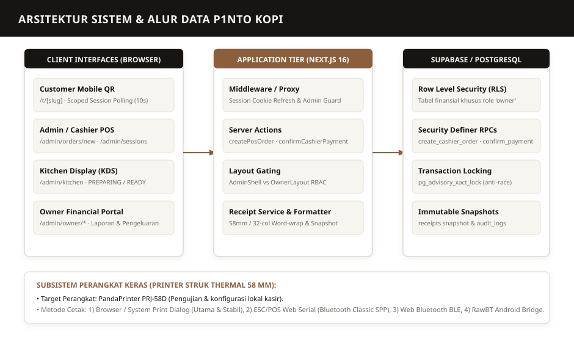

# P1NTO KOPI
## System & Technical Documentation
### Arsitektur Perangkat Lunak, Spesifikasi Basis Data, dan Referensi Teknis Produksi
**Target Situs Web Produksi:** [https://pintokupi.my.id](https://pintokupi.my.id)  
**Versi Sistem:** 1.0.0 (Release Candidate)  
**Commit Acuan Basis Data/Kode:** `f8f9f1b`  
**Tanggal Terbit:** 13 September 2026  
**Klasifikasi Dokumen:** Internal Engineering & Technical Reference  

---

## DAFTAR ISI

1. [Ikhtisar Sistem & Prinsip Desain Arsitektur](#1-ikhtisar-sistem--prinsip-desain-arsitektur)
2. [Tumpukan Teknologi (Technology Stack)](#2-tumpukan-teknologi-technology-stack)
3. [Struktur Direktori & Pola Kode Proyek](#3-struktur-direktori--pola-kode-proyek)
4. [Spesifikasi Rute Aplikasi & Matriks Hak Akses](#4-spesifikasi-rute-aplikasi--matriks-hak-akses)
5. [Autentikasi & Model Keamanan Sesi](#5-autentikasi--model-keamanan-sesi)
6. [Model Otorisasi: Peran Pengguna & Kebijakan RLS](#6-model-otorisasi-peran-pengguna--kebijakan-rls)
7. [Skema Basis Data & Entitas Relasional Inti](#7-skema-basis-data--entitas-relasional-inti)
8. [Arsitektur Sesi Meja (Dining Sessions) & Batasan Tagihan](#8-arsitektur-sesi-meja-dining-sessions--batasan-tagihan)
9. [Siklus Hidup Pesanan & Mesin Status (Order Lifecycle)](#9-siklus-hidup-pesanan--mesin-status-order-lifecycle)
10. [Arsitektur Pembayaran Manual (CASH & QRIS)](#10-arsitektur-pembayaran-manual-cash--qris)
11. [Arsitektur Snapshot Struk Kekal (Receipt Architecture)](#11-arsitektur-snapshot-struk-kekal-receipt-architecture)
12. [Subsistem Pencetakan Struk (ESC/POS & Printer Integration)](#12-subsistem-pencetakan-struk-escpos--printer-integration)
13. [Subsistem Pemesanan QR Meja (Customer Secondary Ordering)](#13-subsistem-pemesanan-qr-meja-customer-secondary-ordering)
14. [Katalog & Referensi Stored Procedures (Database RPCs)](#14-katalog--referensi-stored-procedures-database-rpcs)
15. [Idempotensi, Transaksi Konkuren, & Penguncian Bersamaan](#15-idempotensi-transaksi-konkuren--penguncian-bersamaan)
16. [Pengujian Otomatis (Testing & Quality Assurance)](#16-pengujian-otomatis-testing--quality-assurance)
17. [Konfigurasi Lingkungan & Tata Kelola Penerapan (Deployment)](#17-konfigurasi-lingkungan--tata-kelola-penerapan-deployment)
18. [Disiplin & Tata Kelola Migrasi Basis Data](#18-disiplin--tata-kelola-migrasi-basis-data)
19. [Panduan Pemecahan Masalah Teknis (Debugging & Triage)](#19-panduan-pemecahan-masalah-teknis-debugging--triage)
20. [Batasan Sistem Saat Ini (Known System Boundaries)](#20-batasan-sistem-saat-ini-known-system-boundaries)
21. [Rencana & Potensi Pengembangan Masa Depan](#21-rencana--potensi-pengembangan-masa-depan)
22. [Panduan Pemeliharaan & Pencadangan Sistem (Maintenance & DR)](#22-panduan-pemeliharaan--pencadangan-sistem-maintenance--dr)

---

## 1. IKHTISAR SISTEM & PRINSIP DESAIN ARSITEKTUR

Sistem P1NTO Kopi adalah aplikasi berbasis web modern yang menggabungkan fungsi Point of Sale (POS) kasir kafe, sistem tampilan dapur (*Kitchen Display System* / KDS), portal manajemen finansial pemilik (*Owner Portal*), dan antarmuka pemesanan mandiri pelanggan via QR meja (*Customer Self-Ordering*).



### Prinsip Utama Rekayasa Perangkat Lunak:
1. **Otoritas Finansial & Harga Penuh pada PostgreSQL Server:**  
   Klien (browser pelanggan maupun kasir) tidak pernah dipercaya dalam kalkulasi harga, pajak, atau diskon. Seluruh total dihitung ulang secara deterministik di tingkat basis data server melalui *Security Definer* Stored Procedures (RPC). Manipulasi nilai di sisi klien ditolak secara otomatis.
2. **Kekekalan Snapshot Struk (*Immutable Receipt Snapshot*):**  
   Ketika pembayaran dikonfirmasi, seluruh rincian transaksi (nama menu, varian, harga satuan saat transaksi, catatan, dan nama kasir) dibekukan ke dalam JSON snapshot permanen. Perubahan katalog menu di kemudian hari tidak akan pernah mengubah data historis struk.
3. **Pemisahan Tegas Antara Pembayaran, Pencetakan, dan Penutupan Sesi:**  
   - Konfirmasi pembayaran, pencetakan struk fisik, dan penutupan meja adalah tiga operasi independen.
   - Kegagalan koneksi printer fisik **tidak boleh** membatalkan pembayaran yang telah berhasil.
   - Keberhasilan pencetakan struk **tidak boleh** menutup sesi meja secara otomatis tanpa instruksi kasir.
4. **Proteksi Idempotensi pada Seluruh Operasi Mutasi:**  
   Setiap permintaan pembuatan pesanan, pembayaran, atau penutupan sesi wajib menyertakan kunci idempotensi unik berbasis UUIDv4. Pengiriman ulang (*retry*) jaringan atau klik ganda menghasilkan respon identik tanpa menciptakan duplikasi rekaman di basis data.
5. **Kanal QR Meja Bersifat Sekunder:**  
   QR meja tidak memiliki izin untuk menginisialisasi sesi meja baru. Inisialisasi sesi awal secara eksklusif dikendalikan oleh kasir di meja counter (*Cashier-First*).

---

## 2. TUMPUKAN TEKNOLOGI (TECHNOLOGY STACK)

Seluruh dependensi dan tumpukan teknologi telah diverifikasi langsung dari file konfigurasi proyek `package.json` dan basis kode:

### 2.1 Lapisan Frontend & Aplikasi
* **Framework:** Next.js `16.3.1` (App Router architecture, React Server Components & Server Actions, Turbopack).
* **Library Inti:** React `19.2.8` & React DOM `19.2.8`.
* **Bahasa:** TypeScript `5.x` (Konfigurasi strict type-checking, `noEmit` validation).
* **Styling:** Tailwind CSS `v4.x` via `@tailwindcss/postcss` & `postcss.config.mjs`.
* **Komponen UI:** Shadcn UI base primitives (`@base-ui/react` `1.7.0`, `class-variance-authority`, `lucide-react` `1.31.0`).
* **Animasi & Interaksi:** Framer Motion `13.1.0`, GSAP `3.15.0`, Lenis Smooth Scroll `1.3.26`.
* **Formulir & Validasi:** React Hook Form `7.85.0`, `@hookform/resolvers`, Zod `4.4.3`.
* **Visualisasi QR & Grafik:** `qrcode.react` `4.2.0`, Recharts `3.10.1`.

### 2.2 Lapisan Data & Backend
* **Database & BaaS:** Supabase PostgreSQL `15+`.
* **SDK Akses Data:** `@supabase/ssr` `0.12.4`, `@supabase/supabase-js` `2.109.0`.
* **Keamanan Basis Data:** Row Level Security (RLS), Postgres Advisory Transaction Locks, Security Definer Functions.
* **Penyimpanan Objek:** AWS S3 SDK (`@aws-sdk/client-s3` `3.1111.0`, `@aws-sdk/s3-request-presigner`).

### 2.3 Pengujian & Penjaminan Mutu (QA)
* **Unit Testing:** Vitest `4.1.10`, `@testing-library/react` `16.3.2`.
* **End-to-End (E2E) Testing:** Playwright Test `@playwright/test` `1.62.1`.
* **Linting & Kode Bersih:** ESLint `9.x`, `eslint-config-next` `16.3.1`, Prettier `3.9.6`.

---

## 3. STRUKTUR DIREKTORI & POLA KODE PROYEK

Struktur direktori sumber kode diatur secara modular dan terisolasi:

```text
src/
├── app/                               # Next.js App Router (Rute & Halaman)
│   ├── (marketing)/                   # Rute publik (Homepage, /menu, /cafe, /coffee, /story)
│   ├── admin/                         # Area Terotentikasi Operasional & Manajemen
│   │   ├── (dashboard)/               # Dasbor dengan AdminShell layout
│   │   │   ├── orders/                # Manajemen pesanan & /orders/new (POS mini)
│   │   │   ├── sessions/              # Manajemen sesi meja (/sessions/[id])
│   │   │   ├── tables/                # Manajemen meja (/tables/live & /tables/print)
│   │   │   ├── receipts/              # Daftar struk & pratinjau (/receipts/[id])
│   │   │   ├── menu/                  # Manajemen produk & kategori menu
│   │   │   ├── settings/              # Konfigurasi printer struk & profil bisnis
│   │   │   └── owner/                 # Modul Finansial Khusus Owner (RLS Gated)
│   │   │       ├── finance/           # Ringkasan keuangan laba/rugi
│   │   │       ├── sales/             # Analisis data penjualan terperinci
│   │   │       ├── expenses/          # Pencatatan beban pengeluaran operasional
│   │   │       ├── adjustments/       # Refund & penyesuaian keuangan manual
│   │   │       ├── reports/           # Laporan laba/rugi & ekspor
│   │   │       ├── accounts/          # Manajemen akun staf (peran & aktifasi)
│   │   │       └── audit/             # Log audit sistem
│   │   ├── kitchen/                   # Kitchen Display System (KDS) terisolasi
│   │   └── login/                     # Autentikasi staf/admin masuk sistem
│   ├── api/                           # Endpoint API (Storage & Webhook handler)
│   ├── auth/                          # Aksi server autentikasi (signout, callback)
│   ├── t/[slug]/                      # Kanal Pemesanan Pelanggan via QR Meja
│   │   ├── menu/                      # Menu katalog meja (terotentikasi token sesi)
│   │   ├── product/[productSlug]/     # Detail produk & opsi suhu
│   │   ├── cart/                      # Keranjang pesanan & submit customer
│   │   └── order/[orderNumber]/       # Status pelacakan pesanan pelanggan (polling 10s)
│   ├── globals.css                    # Definisi token desain CSS & Tailwind
│   └── layout.tsx                     # Root HTML layout & font loader
├── components/                        # Komponen Antarmuka Pengguna
│   ├── admin/                         # Komponen POS kasir, owner, KDS, dan tabel
│   ├── ordering/                      # Komponen antarmuka pemesanan QR pelanggan
│   └── ui/                            # Komponen UI primitif (Shadcn base)
├── config/                            # Konfigurasi bisnis baku (BUSINESS)
├── lib/                               # Utilitas, Layanan Bisnis, & Klien API
│   ├── finance/                       # Utilitas format IDR, rentang tanggal, & metrik
│   ├── notifications/                 # Preferensi audio/notifikasi pesanan
│   ├── orders/                        # Mesin status pesanan (status-machine.ts)
│   ├── ordering/                      # Manajemen token sesi meja (cookie storage)
│   ├── payments/                      # Layanan & penyedia pembayaran (CASH, QRIS)
│   ├── printer/                       # ESC/POS encoder, driver Web-Print, Serial, BLE
│   ├── receipt/                       # Receipt snapshot formatter & word-wrap engine
│   └── supabase/                      # Klien Supabase (Server, Client, Middleware)
├── middleware.ts                      # Next.js Edge Middleware (Session Refresh & Admin Guard)
└── types/                             # Definisi Tipe TypeScript & Database Schema Types
```

---

## 4. SPESIFIKASI RUTE APLIKASI & MATRIKS HAK AKSES

Tabel berikut mendokumentasikan seluruh 27 rute yang terkompilasi dalam build produksi:

| Path Rute | Tipe Rendering | Tingkat Akses | Deskripsi Fungsional |
|---|:---:|:---:|---|
| `/` | Dynamic | Publik | Landing page editorial brand P1NTO Kopi. |
| `/menu` | Dynamic | Publik | Katalog menu interaktif publik tanpa meja. |
| `/cafe` | Dynamic | Publik | Profil kafe, suasana, dan fasilitas. |
| `/coffee` | Dynamic | Publik | Informasi roastery & asal biji kopi Nusantara. |
| `/coffee/[slug]` | Dynamic | Publik | Detail profil sangrai biji kopi spesifik. |
| `/locations` | Dynamic | Publik | Lokasi fisik kafe, peta, dan jam operasional. |
| `/story` | Static | Publik | Kisah di balik brand Pintö Kupi. |
| `/t/[slug]` | Dynamic | Publik (Kondisional) | Halaman landing QR meja. Cek sesi via `get_table_session_status`. Jika tidak ada sesi, tolak order. |
| `/t/[slug]/menu` | Dynamic | Session Token | Menu pemesanan meja. Memerlukan cookie token sesi aktif. |
| `/t/[slug]/product/[productSlug]` | Dynamic | Session Token | Halaman kustomisasi varian dan opsi menu meja. |
| `/t/[slug]/cart` | Dynamic | Session Token | Keranjang belanja meja & submit order via `create_customer_order`. |
| `/t/[slug]/order/[orderNumber]` | Dynamic | Session Token | Status pesanan pelanggan. Polling terisolasi setiap 10 detik. |
| `/admin/login` | Dynamic | Publik / Anonim | Halaman masuk staf/admin. Redirect ke `/admin` jika sudah login. |
| `/admin` | Dynamic | Terotentikasi (Staf+) | Dasbor ringkasan operasional kafe harian. |
| `/admin/orders` | Dynamic | Terotentikasi (Staf+) | Antrean manajemen pesanan kafe dengan filter status. |
| `/admin/orders/new` | Dynamic | Terotentikasi (Staf+) | **POS Kasir Mini**: Buat pesanan baru, pilih meja, konfirmasi pelanggan. |
| `/admin/orders/[id]` | Dynamic | Terotentikasi (Staf+) | Detail pesanan, aksi transisi status, pembatalan. |
| `/admin/orders/[id]/receipt` | Dynamic | Terotentikasi (Staf+) | Pratinjau struk pesanan individu / takeaway. |
| `/admin/sessions/[id]` | Dynamic | Terotentikasi (Staf+) | **Detail Sesi Meja**: Tagihan gabungan, bayar Cash/QRIS, tutup sesi meja. |
| `/admin/tables` | Dynamic | Terotentikasi (Admin+) | Manajemen master data meja kafe dan kapasitas. |
| `/admin/tables/live` | Dynamic | Terotentikasi (Staf+) | Pemantauan waktu nyata status keterisian meja. |
| `/admin/tables/print` | Dynamic | Terotentikasi (Admin+) | Halaman cetak lembar QR Code stand meja fisik. |
| `/admin/receipts` | Dynamic | Terotentikasi (Staf+) | Daftar seluruh riwayat struk pembayaran. |
| `/admin/receipts/[id]` | Dynamic | Terotentikasi (Staf+) | Tampilan struk resmi dan aksi cetak ulang (*reprint*). |
| `/admin/kitchen` | Dynamic | Kitchen / Admin / Owner | **Kitchen Display System (KDS)**: Antrean dapur terisolasi. |
| `/admin/menu/products` | Dynamic | Admin / Owner | Pengelolaan katalog menu dan ketersediaan stok. |
| `/admin/menu/categories` | Dynamic | Admin / Owner | Pengelolaan kategori produk kafe. |
| `/admin/settings` | Dynamic | Terotentikasi (Staf+) | Pengaturan printer struk lokal & profil bisnis (khusus Owner). |
| `/admin/owner` | Dynamic | **Khusus Owner** | Dasbor finansial eksekutif. Gated by `OwnerLayout` & RLS. |
| `/admin/owner/finance` | Dynamic | **Khusus Owner** | Ringkasan laba/rugi, pendapatan bersih, dan rata-rata order. |
| `/admin/owner/sales` | Dynamic | **Khusus Owner** | Rincian histori seluruh penjualan yang terverifikasi. |
| `/admin/owner/expenses` | Dynamic | **Khusus Owner** | Manajemen pencatatan beban pengeluaran operasional. |
| `/admin/owner/adjustments` | Dynamic | **Khusus Owner** | Penyesuaian finansial, retur kasir, dan audit refund. |
| `/admin/owner/reports` | Dynamic | **Khusus Owner** | Laporan periode keuangan & analitik performa. |
| `/admin/owner/accounts` | Dynamic | **Khusus Owner** | Manajemen hak akses pengguna (ganti peran, nonaktifkan staf). |
| `/admin/owner/audit` | Dynamic | **Khusus Owner** | Log audit forensik perubahan status & pembayaran. |
| `/api/webhooks/xendit` | Dynamic | Terisolasi | Webhook gateway lama: fail-closed, mengembalikan status 410. |

---

## 5. AUTENTIKASI & MODEL KEAMANAN SESI

Sistem membedakan secara tegas antara otentikasi staf operasional dan otentikasi sesi pelanggan meja.

### 5.1 Otentikasi Staf & Admin (Supabase Auth & SSR)
1. **Penyimpanan Sesi:** Menggunakan paket `@supabase/ssr` yang menyimpan access token dan refresh token di dalam cookie peramban dengan atribut `HttpOnly`, `SameSite=Lax`, dan `Secure` (pada protokol HTTPS).
2. **Middleware Guard (`src/middleware.ts` & `src/lib/supabase/middleware.ts`):**
   - Setiap permintaan rute yang berawalan `/admin` diperiksa keberadaan pengguna aktifnya via `supabase.auth.getUser()`.
   - Permintaan tanpa pengguna valid dialihkan (*307 redirect*) ke `/admin/login`.
   - Token sesi diperbarui secara berkala di latar belakang tanpa mengganggu alur kerja kasir.
3. **Pengecekan Status Aktif Akun (`is_active`):**
   - Pada `src/app/admin/(dashboard)/layout.tsx`, profil pengguna dibaca dari tabel `profiles`.
   - Jika kolom `is_active = false`, sesi seketika ditolak dengan pesan *"Akun Dinonaktifkan"*, meskipun pengguna memiliki kredensial login yang valid.

### 5.1.1 Kredensial Bawaan Sistem (Seeded Environment Accounts)

Untuk kebutuhan deployment, pengujian, dan akses awal operasional kafe, sistem dilengkapi dua akun peran tingkat tinggi yang diinisialisasi melalui database seeds / Supabase Auth:

| Peran | Email Resmi | Sandi Bawaan | Wewenang Sistem |
|---|---|---|---|
| **`owner`** | `owner@pinto.kupi` | `owner123` | Akses penuh: Finansial, audit trail, hapus order, kelola akun staf (`/admin/owner/accounts`), dan profil bisnis (`/admin/settings`). |
| **`admin`** | `admin@pinto.kopi` | `admin123` | Akses manajerial: Operasional kasir POS, katalog menu & kategori, tata letak meja, dan konfigurasi printer. |

> [!IMPORTANT]
> Akun staf kasir (`staff`) dan barista dapur (`kitchen`) dibuat secara mandiri oleh akun Owner melalui portal manajemen akun `/admin/owner/accounts`.

### 5.2 Model Kredensial Pelanggan Meja (Opaque Session Token)
* Pelanggan anonim di meja **tidak menggunakan akun atau login password**.
* Ketika kasir membuka sesi meja melalui POS (`create_cashier_order`), sistem mengenerate token acak 64-karakter heksadesimal yang tidak dapat ditebak:
  ```sql
  replace(gen_random_uuid()::text || gen_random_uuid()::text, '-', '')
  ```
* Saat pelanggan memindai QR meja dan menekan tombol *Tambah Pesanan*, server memanggil `start_or_resume_dining_session` dengan parameter `p_create_if_missing = false`. Token sesi ini disimpan ke dalam cookie klien bernama `pinto_dining_session` dengan atribut `HttpOnly` dan `SameSite=Lax`.
* Token sesi ini menjadi kredensial wajib untuk memanggil RPC `create_customer_order` dan `get_dining_session_summary`. Pelanggan di Meja 02 tidak dapat membaca tagihan atau menambahkan pesanan ke Meja 04 karena token sesi mereka terisolasi secara kriptografis.

---

## 6. MODEL OTORISASI: PERAN PENGGUNA & KEBIJAKAN RLS

Basis data PostgreSQL menerapkan Row Level Security (RLS) pada seluruh tabel operasional dan finansial.

### 6.1 Fungsi Pembantu Peran (Database Role Helpers)
```sql
-- Memeriksa apakah aktor yang sedang login adalah Owner
create or replace function public.is_owner() returns boolean as $$
begin
  return exists (
    select 1 from public.profiles
    where id = auth.uid() and role = 'owner'
  );
end;
$$ language plpgsql security definer set search_path = public;

-- Memeriksa apakah aktor memiliki hak Admin ke atas (Admin atau Owner)
create or replace function public.is_admin() returns boolean as $$
begin
  return exists (
    select 1 from public.profiles
    where id = auth.uid() and role in ('admin', 'owner')
  );
end;
$$ language plpgsql security definer set search_path = public;
```

### 6.2 Kebijakan Keamanan Baris (RLS Policies Summary)
* **Tabel Finansial (`expenses`, `expense_categories`, `financial_adjustments`):**
  - Kebijakan SELECT, INSERT, UPDATE, DELETE hanya diberikan kepada `is_owner() = true`.
  - Upaya pembacaan langsung dari PostgREST API oleh peran `staff`, `kitchen`, `admin`, atau pelanggan anonim akan menghasilkan array kosong atau galat 403 Forbidden.
* **Tabel Sesi Meja (`dining_sessions`):**
  - **Dilarang untuk Akses Langsung Anonim:** Tidak ada kebijakan SELECT atau INSERT untuk anonim pada `dining_sessions`. Akses anonim diwajibkan melalui fungsi *Security Definer* yang memverifikasi kecocokan token sesi.
* **Tabel Pesanan & Pembayaran (`orders`, `payments`, `receipts`):**
  - Pembacaan operasional diperbolehkan untuk peran `staff`, `kitchen`, `admin`, dan `owner`.
  - Mutasi langsung (INSERT/UPDATE/DELETE) dicabut dari peran `anon` dan `authenticated`. Seluruh mutasi transaksi wajib dieksekusi melalui Stored Procedures resmi.

---

## 7. SKEMA BASIS DATA & ENTITAS RELASIONAL INTI

Berikut adalah relasi entitas inti sistem P1NTO Kopi dalam basis data PostgreSQL:

```
┌─────────────────┐
│     TABLES      │
│ id (PK)         │
│ table_number    │
│ slug            │
│ capacity        │
│ is_active       │
└────────┬────────┘
         │ 1
         │
         │ has many
         │
         ▼ *
┌───────────────────────┐
│    DINING_SESSIONS    │
│ id (PK)               │
│ table_id (FK)         │
│ session_token         │
│ status ('open'/'close')│
│ started_at            │
│ closed_at             │
│ completed_by (FK)     │
│ total_snapshot        │
│ receipt_snapshot (JSON)
└──────────┬────────────┘
           │ 1
           │
           │ has many
           │
           ▼ *
┌───────────────────────────┐         1 ┌───────────────────────────┐
│          ORDERS           ├───────────┤         PAYMENTS          │
│ id (PK)                   │           │ id (PK)                   │
│ order_number (UNIQUE)     │           │ order_id (FK, nullable)   │
│ dining_session_id (FK)    │           │ dining_session_id (FK)    │
│ order_type ('DINE_IN'...) │           │ provider ('MANUAL')       │
│ fulfillment_type ('TABLE')│           │ status ('PAID'...)        │
│ total                     │           │ amount                    │
│ status ('NEW'...'SERVED') │           │ payment_method (CASH/QRIS)│
│ client_request_id (UNIQUE)│           │ cash_received             │
│ source ('CASHIER'/...)    │           │ change_amount             │
└──────────┬────────────────┘           │ confirmed_by (FK)         │
           │ 1                          └─────────────┬─────────────┘
           │                                          │ 1
           │ has many                                 │ has one
           ▼ *                                        ▼ 1
┌───────────────────────────┐           ┌───────────────────────────┐
│        ORDER_ITEMS        │           │         RECEIPTS          │
│ id (PK)                   │           │ id (PK)                   │
│ order_id (FK)             │           │ payment_id (FK, UNIQUE)   │
│ product_name_snapshot     │           │ receipt_number (UNIQUE)   │
│ variant_name_snapshot     │           │ snapshot (JSONB)          │
│ quantity                  │           │ issued_by (FK)            │
│ unit_price                │           │ issued_at                 │
│ subtotal                  │           └───────────────────────────┘
└──────────┬────────────────┘
           │ 1
           │ has many
           ▼ *
┌───────────────────────────┐
│    ORDER_ITEM_OPTIONS     │
│ id (PK)                   │
│ order_item_id (FK)        │
│ option_name_snapshot      │
│ option_value_snapshot     │
│ price_adjustment          │
└───────────────────────────┘
```

---

## 8. ARSITEKTUR SESI MEJA (DINING SESSIONS) & BATASAN TAGIHAN

Sesi meja adalah konstruksi logis yang mengikat beberapa pesanan yang dipesan oleh tamu pada meja fisik yang sama menjadi satu kesatuan finansial (*One Bill Boundary*).

### 8.1 Invariant Sesi Meja:
1. **Maksimal Satu Sesi Terbuka per Meja:**  
   Ditegakkan melalui partial unique index pada tingkat basis data:
   ```sql
   create unique index if not exists idx_dining_sessions_one_open_per_table
   on public.dining_sessions (table_id) where status = 'open';
   ```
2. **Penguncian Bersamaan (*Advisory Locking*):**  
   Saat kasir membuka sesi atau pelanggan menyambung sesi, sistem memperoleh kunci transaksi Postgres:
   ```sql
   perform pg_advisory_xact_lock(hashtextextended('dining-table:' || v_table_id::text, 0));
   ```
   Hal ini mencegah kondisi balapan data (*race condition*) ketika dua kasir menetapkan meja yang sama secara bersamaan.
3. **Penyatuan Tagihan Sesi:**  
   Total tagihan sesi meja dihitung dari penjumlahan nilai kolom `total` seluruh pesanan yang memiliki `dining_session_id` terkait, dengan mengecualikan pesanan yang berstatus `CANCELLED`:
   ```sql
   select coalesce(sum(total), 0) from public.orders
   where dining_session_id = v_session_id and status <> 'CANCELLED';
   ```

---

## 9. SIKLUS HIDUP PESANAN & MESIN STATUS (ORDER LIFECYCLE)

Mesin status pesanan diatur oleh modul `src/lib/orders/status-machine.ts` dan ditegakkan dalam database oleh RPC `transition_order_status`.

### 9.1 Definisi Status:
* **`NEW`:** Pesanan berhasil dibuat, valid, dan masuk ke dalam antrean aktif.
* **`PREPARING`:** Sedang dalam proses peracikan kopi atau pengolahan makanan di dapur.
* **`READY`:** Menu telah selesai dibuat dan siap untuk diantarkan ke meja pelanggan.
* **`SERVED`:** Menu telah berhasil disajikan ke meja pelanggan (status terminal normal).
* **`CANCELLED`:** Pesanan dibatalkan dengan pencatatan alasan wajib (status terminal batal).

### 9.2 Matriks Transisi yang Diizinkan (*Allowlist Transitions*):
```typescript
const TRANSITIONS: Record<CanonicalOrderStatus, CanonicalOrderStatus[]> = {
  NEW: ["PREPARING", "CANCELLED"],
  PREPARING: ["READY", "CANCELLED"],
  READY: ["SERVED", "CANCELLED"],
  SERVED: [],      // Terminal state: tidak dapat diubah lagi
  CANCELLED: [],   // Terminal state: tidak dapat diubah lagi
};
```

Setiap transisi status mencatat riwayat perubahan pada tabel `order_status_history` dan merekam entri audit pada `audit_logs` secara otomatis.

---

## 10. ARSITEKTUR PEMBAYARAN MANUAL (CASH & QRIS)

P1NTO Kopi menggunakan provider pembayaran internal berlabel `'MANUAL'` yang dikonfirmasi langsung oleh kasir melalui RPC `confirm_cashier_payment`.

### 10.1 Alur Transaksi Pembayaran:
1. **Target Pembayaran Tunggal:**  
   Pembayaran harus menargetkan tepat satu entitas: `order_id` (untuk takeaway) ATAU `dining_session_id` (untuk dine-in). Ditegakkan oleh konstrain:
   ```sql
   check (num_nonnulls(order_id, dining_session_id) = 1)
   ```
2. **Validasi Tunai (CASH):**  
   - Kasir mengirim parameter `p_tendered_amount`.
   - Sistem memverifikasi `p_tendered_amount >= v_amount`.
   - Kembalian dihitung di server: `change_amount = p_tendered_amount - v_amount`.
3. **Validasi QRIS Manual:**  
   - Kasir wajib mengirim metadata `{"qrisAccepted": true}`.
   - Nominal `p_tendered_amount` wajib bernilai persis sama dengan total tagihan (`v_amount`).
4. **Pencegahan Pembayaran Ganda:**  
   Sebelum menulis baris pembayaran baru, sistem mengunci sesi dengan `pg_advisory_xact_lock` dan memeriksa apakah target sudah memiliki rekaman `status = 'PAID'`. Jika sudah ada, sistem menolak eksekusi dengan galat SQLSTATE `23505`.

---

## 11. ARSITEKTUR SNAPSHOT STRUK KEKAL (RECEIPT ARCHITECTURE)

Struk belanja P1NTO Kopi diproduksi oleh fungsi basis data `build_receipt_snapshot` dan disimpan di tabel `receipts`.

### 11.1 Struktur JSON Snapshot Struk (Schema Version 1):
```json
{
  "schema_version": 1,
  "issued_at": "2026-09-13T12:30:00.000Z",
  "target": { "type": "DINING_SESSION", "id": "uuid-sesi" },
  "settings": {
    "business_name": "Pinto Kupi",
    "tagline": "Roastery & Kafe — Bogor",
    "address": "Jl. Flamboyan No. 8, Tajur Halang",
    "website": "www.pintokupi.my.id",
    "wifi_name": "P1NTO",
    "wifi_password": "terimakasih",
    "footer_message": "Terima kasih telah berkunjung."
  },
  "payment": {
    "id": "uuid-payment",
    "method": "CASH",
    "amount": 70000,
    "cash_received": 100000,
    "change_amount": 30000,
    "paid_at": "2026-09-13T12:30:00.000Z",
    "cashier_id": "uuid-kasir"
  },
  "orders": [
    {
      "order_number": "Pinto-260913-0001",
      "subtotal": 70000,
      "total": 70000,
      "table_number": "04",
      "items": [
        {
          "product_name": "Sanger Latte",
          "quantity": 2,
          "unit_price": 15000,
          "subtotal": 30000,
          "options": [{ "option_name": "Suhu", "option_value": "Dingin / Ice", "price_adjustment": 0 }]
        }
      ]
    }
  ]
}
```

### 11.2 Engine Pemformatan Teks 58 mm (`src/lib/receipt/receipt-service.ts`):
* Diformat tepat **32 karakter per baris** untuk 58 mm (`RECEIPT_LINE_WIDTHS[58] = 32`) dan 48 karakter untuk 80 mm.
* **Format Ringkas Hemat Kertas (*Paper-Saving Compact Format*):** Header kelompok pesanan (`ORDER Pinto-...`) sengaja dihilangkan dari hasil cetak teks struk. Seluruh item menu dari sesi meja langsung tercantum berurutan di bawah nomor meja (`MEJA xx`), memotong 3+ baris kertas per pesanan tambahan. Bukti sah audit tetap terikat pada referensi `BILL` dan `SESI` di bagian atas.
* **Branding Bisnis:** Menggunakan nama `Pinto Kupi` dan membaca profil bisnis dari tabel `app_settings` (dengan fallback yang aman).
* Menggunakan algoritma pembungkusan kata (*word-wrap*) cerdas: nama menu atau catatan yang panjang dibungkus ke baris baru tanpa ada teks yang terpotong.
* Fungsi murni (*pure function*): `formatReceiptText(data, paperWidth)` bersifat deterministik dan diverifikasi oleh rangkaian unit test vitest.

---

## 12. SUBSISTEM PENCETAKAN STRUK (ESC/POS & PRINTER INTEGRATION)

Sistem mengintegrasikan printer thermal PandaPrinter PRJ-58D melalui beberapa penyedia (*provider*) transport:

### 12.1 Provider Transport Struk:
1. **`web-print` (Default & Fallback Produksi):**  
   Menghasilkan HTML ramah cetak khusus thermal dan memanggil `window.print()`. Driver sistem operasi Windows/Android menangani komunikasi fisik perangkat.
2. **`escpos-bluetooth` (ESC/POS over Web Serial):**  
   Menggunakan API Web Serial untuk berkomunikasi langsung dengan port Bluetooth Classic SPP (RFCOMM). Mengirim byte biner ESC/POS terkompilasi.
3. **`web-bluetooth` (Web Bluetooth BLE):**  
   Berkomunikasi dengan printer BLE via GATT characteristics.
4. **`android-bridge` (RawBT):**  
   Mengirim payload ESC/POS melalui intent bridge aplikasi RawBT pada perangkat Android.

### 12.2 Isolasi Kegagalan Cetak:
* Setiap upaya pencetakan dicatat ke dalam tabel `receipt_print_attempts` dengan status `'REQUESTED'`, `'SUCCEEDED'`, atau `'FAILED'`.
* Galat koneksi printer (kehabisan kertas, bluetooth putus) tidak memiliki efek samping terhadap mutasi database; status pembayaran tetap `PAID` dan transaksi keuangan tetap valid.

---

## 13. SUBSISTEM PEMESANAN QR MEJA (CUSTOMER SECONDARY ORDERING)

Pemesanan mandiri pelanggan via QR meja dirancang dengan batas-batas keamanan ketat:

### 13.1 Alur Pengecekan Keterisian Meja:
1. Pelanggan membuka `/t/[slug]`.
2. Server Next.js memanggil RPC `get_table_session_status(p_table_slug)`.
3. Fungsi ini bersifat `STABLE` dan hanya mengembalikan status boolean:
   ```json
   { "success": true, "table_number": "04", "has_active_session": true }
   ```
   Token sesi dan informasi pesanan orang lain **tidak pernah diekspos** pada panggilan publik ini.
4. Jika `has_active_session = false`, UI hanya merender teks penolakan *"Belum ada sesi aktif"*, tanpa formulir keranjang belanja.

### 13.2 Polling Terisolasi (*Scoped Polling*):
* Halaman pelacakan status pesanan pelanggan (`/t/[slug]/order/[orderNumber]`) menggunakan mekanisme polling terisolasi dengan interval 10 detik (`POLL_INTERVAL_MS = 10_000`).
* Polling dijeda secara otomatis ketika tab peramban disembunyikan (*backgrounded*) menggunakan event `visibilitychange`, guna menghemat kuota data dan beban server.
* Polling hanya memanggil RPC `get_dining_session_summary` yang mewajibkan token sesi meja yang valid. Tidak ada langganan *Realtime websocket* publik yang terbuka untuk pelanggan anonim.

---

## 14. KATALOG & REFERENSI STORED PROCEDURES (DATABASE RPCS)

Tabel berikut menyajikan seluruh stored procedures utama yang mengatur logika bisnis:

| Nama Fungsi RPC | Parameter Input Utama | Izin Pemanggil | Efek Bisnis & Validasi Kritis |
|---|---|:---:|---|
| **`create_cashier_order`** | `p_idempotency_key`, `p_items`, `p_table_id`, `p_fulfillment_type`, `p_dining_session_id` | Kasir (`staff`, `admin`, `owner`) | Membuka sesi meja jika baru, atau memvalidasi sesi jika gabung. Menghitung harga server-side, mencegah silent merge pada meja terisi (SQLSTATE 23514). Status awal `NEW`. |
| **`create_customer_order`** | `p_table_slug`, `p_session_token`, `p_request_id`, `p_notes`, `p_items` | Pelanggan Meja (Token Sesi) | Validasi token sesi aktif. Hitung ulang harga server-side, cek opsi wajib. Tambah pesanan ke sesi meja yang sama. Menolak jika sesi sudah dibayar. |
| **`confirm_cashier_payment`** | `p_idempotency_key`, `p_method`, `p_order_id`, `p_dining_session_id`, `p_tendered_amount` | Kasir (`staff`, `admin`, `owner`) | Memvalidasi kecukupan nominal cash/QRIS, mengunci sesi, mencatat row `payments` status `PAID`, dan menerbitkan `receipts.snapshot` kekal. |
| **`complete_dining_session`** | `p_dining_session_id`, `p_idempotency_key` | Kasir (`staff`, `admin`, `owner`) | Memvalidasi bahwa seluruh order berstatus `SERVED`/`CANCELLED` dan sesi telah `PAID`. Menutup sesi (`closed`) dan membebaskan meja. |
| **`transition_order_status`** | `p_order_id`, `p_expected_status`, `p_new_status`, `p_reason` | Kitchen, Staff, Admin, Owner | Mengeksekusi transisi status kanonikal dengan optimistic locking dan pengecekan izin peran. Menolak pembatalan pada order yang telah dibayar. |
| **`start_or_resume_dining_session`** | `p_table_slug`, `p_create_if_missing` | Anonim / Pelanggan | Memeriksa sesi meja aktif. Jika `p_create_if_missing = false` dan sesi tidak ada, menolak pembuatan sesi (NO_ACTIVE_SESSION). |
| **`get_table_session_status`** | `p_table_slug` | Publik / Anonim | Mengembalikan boolean keterisian meja tanpa membocorkan session token. |
| **`get_dining_session_summary`** | `p_table_slug`, `p_session_token` | Pelanggan Meja (Token Sesi) | Mengembalikan ringkasan pesanan, total tagihan, dan status pembayaran khusus untuk meja pemegang token. |
| **`get_financial_summary`** | `p_start`, `p_end` | **Khusus Owner** (`is_owner()`) | Menghitung omzet terealisasi, total beban biaya, laba bersih, dan metrik finansial terverifikasi. Ditolak untuk non-owner. |

---

## 15. IDEMPOTENSI, TRANSAKSI KONKUREN, & PENGUNCIAN BERSAMAAN

Sistem P1NTO Kopi dirancang tahan terhadap gangguan jaringan fluktuatif dan pengiriman ulang data berulang kali (*duplicate submissions*).

### 15.1 Algoritma Idempotensi:
1. Setiap permintaan POST kasir/pelanggan menghasilkan `client_request_id` unik (berbasis UUID).
2. Sistem membuat hash sidik jari permintaan (*request fingerprint*) menggunakan SHA-256 dari muatan data JSON:
   ```sql
   v_request_fingerprint := encode(sha256(convert_to(payload::text, 'UTF8')), 'hex');
   ```
3. Jika permintaan dengan ID yang sama diterima kembali:
   - Jika muatan data identik: Mengembalikan hasil transaksi yang telah tersimpan sebelumnya (*idempotent replay*).
   - Jika muatan data berbeda: Menolak transaksi dengan galat SQLSTATE `23505` (*"Idempotency key was already used with different order data"*).

### 15.2 Mekanisme Kunci Transaksi (PostgreSQL Advisory Locks):
Untuk mencegah anomali pembacaan dan kondisi balapan (*race condition*), sistem menggunakan kunci eksplisit:
* `dining-table:<table_id>`: Mengunci keputusan pembukaan sesi per meja fisik.
* `payment-session:<session_id>`: Mengunci kalkulasi total tagihan saat pembayaran berlangsung, mencegah penambahan pesanan baru saat kasir sedang memproses pembayaran.
* `cashier-payment:<idempotency_key>`: Mengunci pemrosesan pembayaran agar tidak ada dua proses paralel yang menduplikasi pembayaran.

---

## 16. PENGUJIAN OTOMATIS (TESTING & QUALITY ASSURANCE)

Keandalan sistem dipelihara melalui rangkaian pengujian otomatis komprehensif:

### 16.1 Pengujian Unit (Vitest)
Dijalankan melalui perintah:
```bash
npm test
```
* **Hasil Verifikasi:** 9 test files, 95 unit tests lulus 100% (0 fail).
* Cakupan pengujian:
  - Validasi mesin status pesanan & aturan transisi peran (`status-machine.test.ts`).
  - Encoding byte ESC/POS untuk pencetakan thermal (`escpos-encoder.test.ts`).
  - Perhitungan periode finansial & alokasi pendapatan (`period.test.ts`, `finance.test.ts`).
  - Layanan pembayaran & penolakan penyedia nonaktif (`payment-service.test.ts`).
  - Pemformatan receipt snapshot & wrapping 32 kolom (`receipt-service.test.ts`).
  - Penanganan webhook Xendit yang dipensiunkan (`route.test.ts`).

### 16.2 Pengujian End-to-End (Playwright)
Dijalankan melalui perintah:
```bash
npm run e2e
```
* Menguji skenario browser nyata:
  - Alur kasir: Pesanan baru → Pemilihan meja → Review step → Konfirmasi → Penolakan meja terisi → Opsi gabung ke sesi.
  - Alur seluler: Pengujian multi-resolusi (360px, 375px, 390px, 412px) untuk penolakan QR meja tanpa sesi aktif dan verifikasi ketiadaan tombol pembayaran online.

---

## 17. KONFIGURASI LINGKUNGAN & TATA KELOLA PENERAPAN (DEPLOYMENT)

### 17.1 Parameter Produksi
* **Domain Produksi:** `https://pintokupi.my.id`
* **Infrastruktur Web:** Next.js Hosted Environment (Vercel / VPS Ubuntu Node.js 20+).
* **Infrastruktur Basis Data:** Supabase Cloud PostgreSQL 15+ (Region: Singapore).

### 17.2 Variabel Lingkungan Konseptual (Tanpa Rahasia Nyata):
```env
# URL & Kunci Publik Supabase (Aman diakses peramban)
NEXT_PUBLIC_SUPABASE_URL=https://[YOUR_PROJECT_ID].supabase.co
NEXT_PUBLIC_SUPABASE_ANON_KEY=eyJhbGciOiJIUzI1NiIsInR5cCI6...

# Kunci Layanan Server-Side (Rahasia - Hanya di lingkungan server)
SUPABASE_SERVICE_ROLE_KEY=eyJhbGciOiJIUzI1NiIsInR5cCI6...

# Konfigurasi Domain
NEXT_PUBLIC_APP_URL=https://pintokupi.my.id
```

> [!CAUTION]
> **Prinsip Keamanan Rahasia:**  
> Dilarang keras mengunggah `SUPABASE_SERVICE_ROLE_KEY` atau kata sandi database ke repositori git publik. Kunci *service role* mengabaikan seluruh kebijakan RLS.

---

## 18. DISIPLIN & TATA KELOLA MIGRASI BASIS DATA

Basis data dikelola menggunakan migrasi terurut maju (*Forward-Only Migrations*) pada folder `supabase/migrations/`:

### Aturan Baku Migrasi:
1. **Pemberian Nama Terurut:** Setiap file migrasi menggunakan format prefiks 4-digit angka (contoh: `0026_...`, `0027_...`, `0031_p1nto_cashier_first.sql`).
2. **Tidak Ada Rollback Destruktif:** Skema yang telah diterapkan di lingkungan produksi tidak boleh diubah dengan menghapus kolom atau enum lama yang masih memiliki referensi historis. Perubahan dilakukan secara aditif (*forward-only compensating migration*).
3. **Pemisahan ALTER TYPE:** Perubahan tipe ENUM (`ALTER TYPE ... ADD VALUE`) wajib dipisahkan dari transaksi fungsi yang langsung menggunakannya, untuk mematuhi aturan PostgreSQL.
4. **Verifikasi Staging:** Sebelum diterapkan ke basis data produksi `pintokupi.my.id`, migrasi wajib diuji coba pada basis data lokal/staging.

---

## 19. PANDUAN PEMECAHAN MASALAH TEKNIS (DEBUGGING & TRIAGE)

| Kode Galat / Gejala | Sumber Penyebab | Solusi Rekayasa |
|---|---|---|
| **SQLSTATE `23514`** | Pelanggaran aturan bisnis (misal: meja terisi, pesanan belum `SERVED` saat tutup sesi, cash kurang). | Tangkap pesan terkurasi dari database dan tampilkan sebagai toast ramah kasir. Jangan ubah paksa constraint. |
| **SQLSTATE `23505`** | Konflik idempotensi atau duplikasi kunci unik. | Pastikan klien menghasilkan UUID baru untuk pesanan baru, atau verifikasi apakah transaksi sebelumnya sudah berhasil dicatat. |
| **SQLSTATE `42501`** | Akses ditolak RLS / Hak akses peran tidak mencukupi. | Periksa peran pengguna di tabel `profiles`. Pastikan akun memiliki peran yang berhak (misal: hanya `owner` untuk finansial). |
| **PGRST `203`** | PostgREST kebingungan mencocokkan overload fungsi RPC yang memiliki nama sama dengan jumlah argumen berbeda. | Hapus fungsi overload lama yang tidak terpakai menggunakan `DROP FUNCTION public.nama_fungsi(...)` spesifik. |

---

## 20. BATASAN SISTEM SAAT INI (KNOWN SYSTEM BOUNDARIES)

Sebagai sistem POS produksi yang stabil dan terfokus pada efisiensi operasional kafe, sistem memiliki batasan desain yang disengaja (*intentional boundaries*):
1. **Gateway Pembayaran Daring Dipensiunkan:**  
   Gateway pihak ketiga (seperti Xendit) telah dinonaktifkan secara permanen. Transaksi hanya memproses metode **CASH** dan **QRIS Manual**.
2. **Ketiadaan Fitur Split Bill:**  
   Satu sesi meja mewakili satu entitas tagihan tunggal (*one bill boundary*). Tagihan tidak dapat dipecah ke beberapa struk parsial secara komputasi.
3. **QR Meja Khusus Tambah Pesanan:**  
   Pelanggan tidak dapat membuka sesi meja baru secara mandiri dari smartphone tanpa interaksi kasir terlebih dahulu.
4. **Pelanggan Tidak Dapat Membatalkan Pesanan Sendiri:**  
   Seluruh pembatalan pesanan wajib diproses melalui otorisasi staf di kasir.
5. **Ketiadaan Sistem Antrean Nomor Digital Takeaway:**  
   Pesanan bawa pulang menggunakan identitas nama panggilan pelanggan, bukan dispenser tiket antrean digital otomatis.

---

## 21. RENCANA & POTENSI PENGEMBANGAN MASA DEPAN

Fitur-fitur berikut diidentifikasi sebagai peluang pengembangan pada fase berikutnya (*Roadmap M6+*):
* **Websocket Realtime Terproteksi untuk Pelanggan:** Menggantikan polling 10 detik dengan langganan Supabase Realtime yang terautentikasi token sesi.
* **Integrasi Pemotong Kertas Otomatis (*Auto-Cutter*) ESC/POS:** Penambahan perintah ESC/POS `GS V 0` untuk printer thermal yang memiliki pisau pemotong otomatis.
* **Modul Inventori Stok Realtime Bahan Baku:** Pengurangan otomatis stok susu, biji kopi, dan kemasan botol setiap kali pesanan berstatus `PREPARING`.
* **Analisis Jam Sibuk Kafe (*Heatmap Analytics*):** Visualisasi grafik jam-jam tersibuk kafe pada portal Owner untuk mengoptimalkan jadwal giliran kerja staf.

---

## 22. PANDUAN PEMELIHARAAN & PENCADANGAN SISTEM (MAINTENANCE & DR)

### Prosedur Pencadangan Terjadwal (*Backup Routine*):
1. **Pencadangan Basis Data Otomatis:** Supabase Cloud menjalankan pencadangan harian (*Daily Automated Backups*) dengan retensi Point-in-Time Recovery (PITR).
2. **Pencadangan Manual Bulanan:**
   Lakukan ekspor skema dan data melalui Supabase CLI:
   ```bash
   supabase db dump -f pinto_backup_$(date +%Y%m%d).sql
   ```
3. **Penyimpanan Berkas Cadangan:** Simpan file backup SQL terenkripsi pada repositori penyimpanan dingin yang terpisah dari server produksi.

### Prosedur Pemulihan Bencana (*Disaster Recovery*):
Jika terjadi kegagalan fatal pada kluster basis data:
1. Alihkan DNS domain `pintokupi.my.id` ke halaman pemeliharaan statis (*Maintenance Mode*).
2. Pulihkan data cadangan terbaru ke instance Supabase baru.
3. Perbarui variabel lingkungan `NEXT_PUBLIC_SUPABASE_URL` dan kunci akses pada platform hosting.
4. Jalankan rangkaian uji asap (*smoke test*) kasir-pertama sebelum membuka kembali akses operasional.
